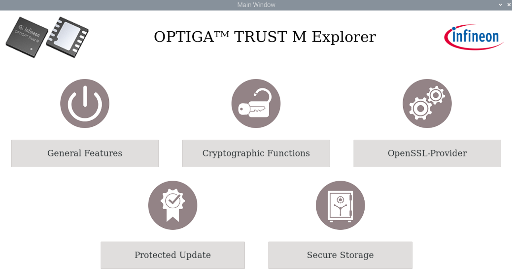
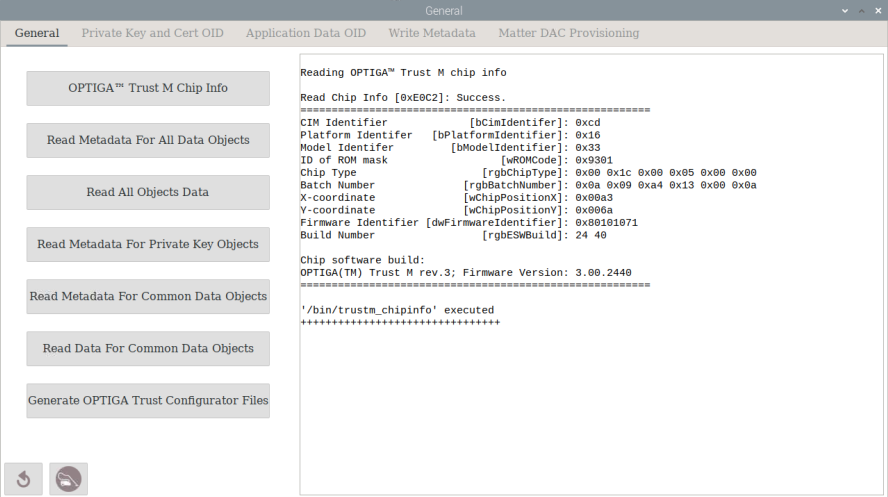

# **OPTIGA™ Trust M Explorer**

The OPTIGA™ Trust M Explorer is a GUI-based tool for users to familiarize themselves with Trust M quickly and easily using Infineon's OPTIGA™ Trust M solution for Raspberry Pi. In addition, the OPTIGA™ Trust M Explorer demonstrates how the OPTIGA™ Trust M can be used to increase security and trust for data sharing across different networking and cloud platforms.

Using this tool, you can instantly experience the benefits that OPTIGA™ Trust M will bring to IoT devices and network equipment.

Tool highlights include the opportunity to explore OPTIGA™ Trust M features and use cases faster - without having to familiarize yourself with Trust M or various command sets. You simply select a button to activate the relevant function or task. Once you select a button, the view menu gives you instant visual feedback, showing the commands that have been executed and the corresponding responses. This easy-to-use GUI makes it possible for all users - regardless of their level of experience or knowledge - to effortlessly access different OPTIGA™ Trust M features and explore common use cases.

## Features

-   Shows OPTIGA™ Trust M commands executed and the corresponding responses on the display screen or the terminal in the background
-   Displays all properties defined within an OPTIGA™ Trust M
-   Read/Write data/Certificate into OPTIGA™ Trust M
-   Cryptographic support:
    ECC : NIST curves up to P-521, Brainpool r1 curve up to 512,
    RSA® up to 2048
    AES key up to 256 ,
-   Encrypts and decrypts data using ECC/RSA/AES
-   Signs and verifies data with ECC

## Use cases

-   Secure Storage
-   Protected Update
-   Cryptographic operations using OpenSSL library
-   Secured communications with OpenSSL library

## Hardware requirements

- Raspberry PI 4 on Linux kernel >= 5.15

- Micro SD card (≥16GB)

- [S2GO SECURITY OPTIGA™ Trust M](https://www.infineon.com/cms/en/product/evaluation-boards/s2go-security-optiga-m/)  or [OPTIGA™ Trust M MTR SHIELD](https://www.infineon.com/cms/en/product/evaluation-boards/trust-m-mtr-shield/)

- [Shield2Go Adapter for Raspberry Pi](https://www.infineon.com/cms/en/product/evaluation-boards/s2go-adapter-rasp-pi-iot/) or [Pi Click Shield](https://www.mikroe.com/pi-4-click-shield) 

  

  Figure 1 Hardware  Connection for S2GO SECURITY OPTIGA™ Trust M using  S2GO SECURITY OPTIGA™ Trust M

  

Figure 2 Hardware  Connection for OPTIGA™ Trust M MTR SHIELD  using  Pi Click Shield

## Setup environment

This tool was tested on a Raspberry Pi  4 Model B with Raspbian Linux release version 12 (Bookworm) and kernel version 6.6.31+rpt-rpi-v8.

The following software is required for the OPTIGA™ Trust M:
- wxpython-tools
- OpenSSL development library (libssl-dev)
- OpenSSL 3.x
- OPTIGA Trust M1/M3 library (source code)
- pthread
- rt
- PyPubSub 

For more information on how to setup the tool environment, refer to the [OPTIGA™ Trust M Setup Guide](./Setup%20Guide.md)

## User guide

Learn more about the tool, how it works and OPTIGA™ Trust M functionality by the following example illustrations and simple step-by-step instructions;  see the [OPTIGA™ Trust M Explorer User Guide](./User%20Guide.md) for details.

## Resources

You will find relevant resources (tools, open source host code and application notes) to help you study OPTIGA™ Trust M and learn more about it on [Infineon OPTIGA™ Trust M GitHub](https://github.com/Infineon/optiga-trust-m) and [Infineon OPTIGA™ Trust M Linux tools GitHub](https://github.com/Infineon/linux-optiga-trust-m)

## License

The OPTIGA™ Trust M Explorer is released under the MIT License; see the [LICENSE](LICENSE) file for details.

