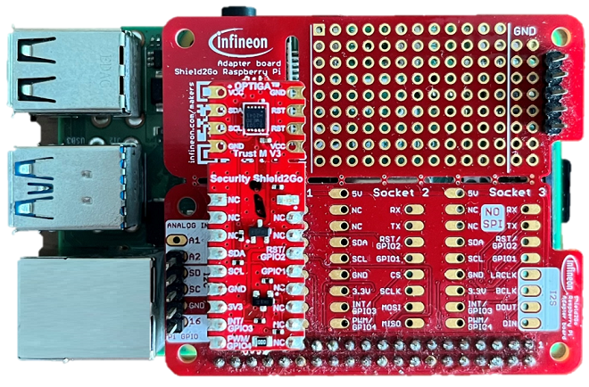
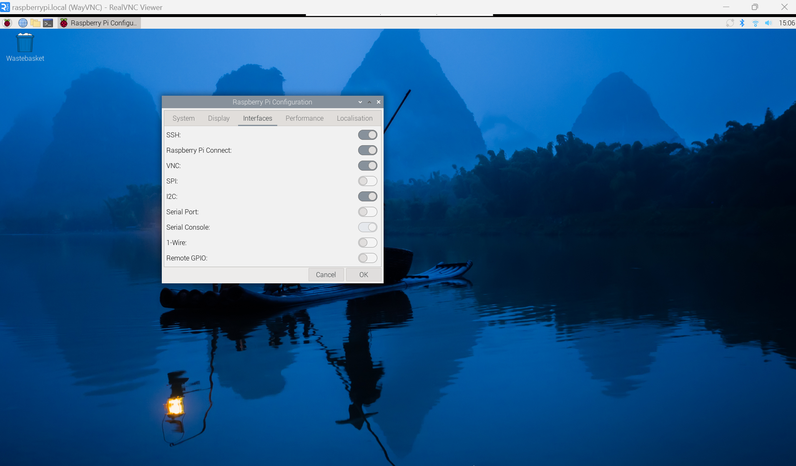
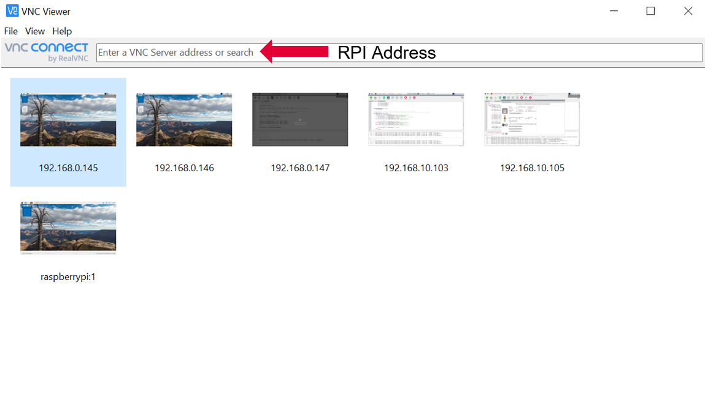
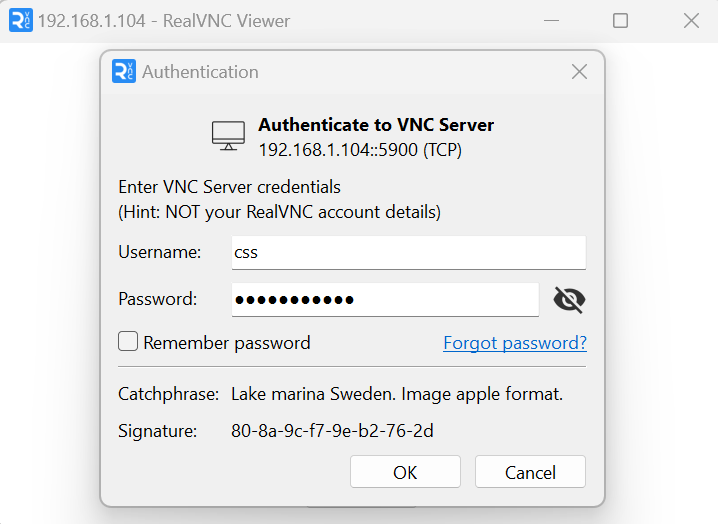

# **OPTIGA™ Trust M Explorer Setup Guide**

## About this document

#### Scope and purpose

The purpose of this document is to provide instructions on how to install and configure the Raspberry Pi® to enable the OPTIGA™ Trust M in order to use the OPTIGA™ Trust M Explorer Application.

#### Table of contents

[About this document ](#about-this-document)

[Table of contents](#table-of-contents)

[1 Prepare Raspberry Pi®](#prepare-raspberry-pi®)

[1.1 Prerequisites](#prerequisites)

[2 Interface Setup](#interface-setup)

[3 Install OPTIGA™ Trust M Explorer](#install-trust-m-explorer)

[3.1 OPTIGA™ Trust M Explorer Installation Guide](#trust-m-explorer-installation-guide)

[References](#references)


# Prepare Raspberry Pi® 

This section describes all necessary steps needed to build a Raspberry Pi® bootable SD card image.

## Prerequisites 

-   Raspberry PI 4 on Linux kernel >= 5.15
- Micro SD card (≥16GB)

- [S2GO SECURITY OPTIGA™ Trust M](https://www.infineon.com/cms/en/product/evaluation-boards/s2go-security-optiga-m/)  or [OPTIGA™ Trust M MTR SHIELD](https://www.infineon.com/cms/en/product/evaluation-boards/trust-m-mtr-shield/)

- [Shield2Go Adapter for Raspberry Pi](https://www.infineon.com/cms/en/product/evaluation-boards/s2go-adapter-rasp-pi-iot/) or [Pi Click Shield](https://www.mikroe.com/pi-4-click-shield) 

  

  Figure 1 Hardware  Connection for S2GO SECURITY OPTIGA™ Trust M using  S2GO SECURITY OPTIGA™ Trust M

  

Figure 2 Hardware  Connection for OPTIGA™ Trust M MTR SHIELD  using  Pi Click Shield

**Table 1** shows a summary of the hardware and environment used.

| Hardware                                                     | Version   and Firmware/OS                                    | Comment                                                      |
| ------------------------------------------------------------ | ------------------------------------------------------------ | ------------------------------------------------------------ |
| Host  PC                                                     | Running Linux/Windows®, for example Ubuntu® 22.04 above or Windows 11 as long as VNC viewer is present | This  platform is used for interacting with  the Raspberry Pi® in a more convenient and faster way compared to doing all  actions directly on the Raspberry Pi®. |
| OPTIGA™ Trust M MTR SHIELD or OPTIGA™ Trust M Security Shield2GO | The OPTIGA™ Trust M chip can be one of the following variants  <br />• V3/MTR/Express | This  board contains the Infineon OPTIGA™ Trust M chip mounted on an  easy-to-use hardware board, which can be attached to the Raspberry Pi®. |
| Raspberry  Pi® Board                                         | •  Model 4 , Raspberry pi<br />•  Micro SD Card with at least 16 GB<br />•  USB cable for power supply(Micro-B/Type-C) | A SD  card with the Raspberry pi Debian 12 and a Raspberry pi Linux kernel version 5.15 and above on it is required, which can be downloaded at [[1]](#_References). This SD card will be  plugged in the developer PC |

# Interface Setup

This step guide you on how to set up the required interface needed to communicate with Trust M.

Start-up the Raspberry Pi with HDMI cable to monitor and select Preferences->Raspberry Pi Configuration. Select the **Interface** tab. Enable **I2C**,**SSH** and **VNC** as follow.

|  |
| ------------------------------- |

[^Figure 2]: RPI Home Screen on monitor

 Enter "hostname -I" into the **Terminal** and copy the IP address

```
hostname -I       
192.168.###.###
```

Paste the IP Address of RPI4 into VNC Viewer on the host PC to connect to the RPI.

|  |
| ------------------------------------------------------ |

[^Figure 3]: VNC Viewer Connection Screen

Enter the Username and the Password.

Username: pi

The password is the same as the password entered when setting up raspberry pi

|  |
| -------------------------------------------- |

[^Figure 4]: VNC Viewer Authentication Menu

You should be successfully connected and able to view the RPI through VNC connection on your device.

|  |
| -------------------------------------------- |

[^Figure 5]: RPI Home Screen on VNC Viewer


# Install OPTIGA™ Trust M Explorer 

## OPTIGA™ Trust M Explorer Installation Guide

Clone Trust M_Explorer Source Code:  

```
git clone --recurse-submodules https://github.com/Infineon/optiga-trust-m-explorer.git

```

Execute Installation script:

```
cd optiga-trust-m-explorer
./installation_script.sh
```

The installation script installs the following dependencies required and compiles the source code for the OPTIGA™ Trust M Explorer Application.

-   wxpython-tools
-   OpenSSL development library (libssl-dev)
-   OpenSSL 3.x
-   OPTIGA Trust M library (source code)
-   pthread
-   rt
-   PyPubSub

This process should take up to 15 minutes.

To start the OPTIGA™ Trust M Explorer Application

Go to directory "optiga-trust-m-explorer/src/Python_TrustM_GUI"

```
cd src/Python_TrustM_GUI
./start_gui.sh
```

A terminal will pop up and the OPTIGA™ Trust M Explorer interface will be open.

|  |
| ------------------------------------- |

[^Figure 6]: Home Screen of OPTIGA™ Trust M Explorer

For more information on the OPTIGA™ Trust M Explorer, please refer to the [OPTIGA™ Trust M User Guide](./User%20Guide.md).

# References

1.  https://www.raspberrypi.com/software/operating-systems/
