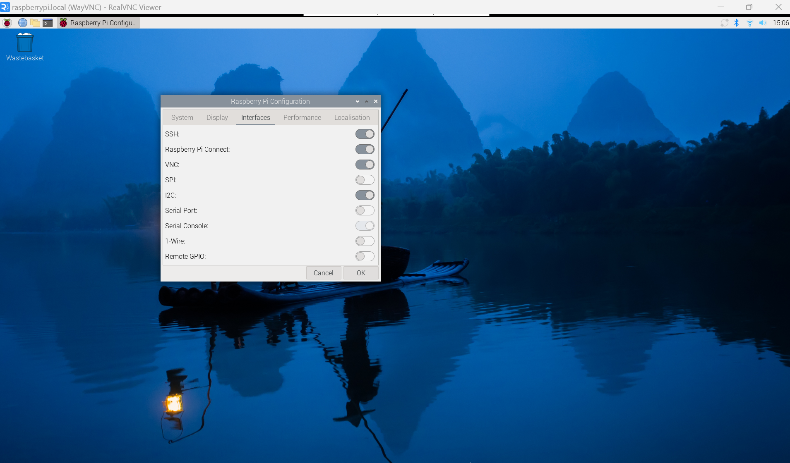

# **OPTIGA™ Trust M Explorer Setup Guide**

## About this document

#### Scope and purpose

The purpose of this document is to guide users on how to set up their RPI to enable the OPTIGA™ Trust M in order to use the OPTIGA™ Trust M Explorer Application.

#### Intended audience

This document is intended for the users wish to explore the functionalities of the OPTIGA™ Trust M.

#### Table of contents

[About this document ](#about-this-document)

[Table of contents](#table-of-contents)

[1 Prepare Raspberry Pi®](#prepare-raspberry-pi®)

[1.1 Prerequisites](#prerequisites)

[2 Interface Setup](#interface-setup)

[3 Install Trust M_Explorer](#install-trust-m-explorer)

[3.1 Trust M_Explorer Installation Guide](#trust-m-explorer-installation-guide)

[References](#references)


# Prepare Raspberry Pi® 

This section describes all necessary steps needed to build a Raspberry Pi® bootable SD card image.

## Prerequisites 

-   Raspberry Pi®
-   Micro SD card (≥8GB) flashed with Raspberry Pi® OS Debian 11 (bullseye) and Raspbian Linux kernel version 5.15 . Download the official image from [[1]](#references)
-   OPTIGA™ Trust M  (M1/M3)

|  |
| ------------------------------------ |

Figure 1 OPTIGA™ Trust M on RPI 

**Table 1** shows a summary of the hardware and environment used.

| Hardware                   | Version   and Firmware/OS                                    | Comment                                                      |
| -------------------------- | ------------------------------------------------------------ | ------------------------------------------------------------ |
| Host  PC                   | Running Linux/Windows®, for example Ubuntu® 18.04 above or Windows 10 as long as VNC viewer is present | This  platform is used for interacting with  the Raspberry Pi® in a more convenient and faster way compared to doing all  actions directly on the Raspberry Pi®. |
| Trust M Security Shield2GO | The Trust M chip can be one of the following variants  <br />• M1  <br />• M3 | This  board contains the Infineon OPTIGA™ Trust M chip mounted on an  easy-to-use hardware board, which can be attached to the Raspberry Pi®. |
| Raspberry  Pi® Board       | •  Model 3/4 , Raspberry pi<br />•  Micro SD Card with at least 8 GB<br />•  USB cable for power supply(Micro-B/Type-C) | A SD  card with the Raspberry pi Debian 11 and a Raspberry pi Linux kernel version 4.19 and above on it is required, which can be downloaded at [[1]](#_References). This SD card will be  plugged in the developer PC |


# Interface Setup

This step guide you on how to set up the required interface needed to communicate with Trust M.

Start-up the Raspberry Pi with HDMI cable to monitor and select Preferences->Raspberry Pi Configuration. Select the **Interface** tab. Enable **I2C**,**SSH** and **VNC** as follow.

|  |
| ------------------------------- |

[^Figure 2]: RPI Home Screen on monitor

 Enter "hostname -I" into the **Terminal** and copy the IP address

```
hostname -I       
192.168.###.###
```

Paste the IP Address of RPI3 into VNC Viewer on the host PC to connect to the RPI.

|  |
| ------------------------------------------------------ |

[^Figure 3]: VNC Viewer Connection Screen

Enter the Username and the Password.

Username: pi

The password is the same as the password entered when setting up raspberry pi

|  |
| ------------------------------------------------------------ |

[^Figure 4]: VNC Viewer Authentication Menu

You should be successfully connected and able to view the RPI through VNC connection on your device.

|  |
| ------------------------------------------------------------ |

[^Figure 5]: RPI Home Screen on VNC Viewer


# Install Trust M Explorer 

## Trust M Explorer Installation Guide

Download Trust M_Explorer Source Code:  

```
git clone -b provider_dev --recurse-submodules https://github.com/ying-css/optiga-trust-m-explorer.git

```

Go to the following directory

```
cd optiga-trust-m-explorer
```

Execute Installation script:

```
./trust_m_installation_script.sh
```

To start the Trust M Explorer Application

Go to directory "optiga-trust-m-explorer/Python_TrustM_GUI"

```
./start_gui.sh
```

The installation script installs the following dependencies required and compiles the source code for the OPTIGA™ Trust M Explorer Application.

-   python-wxtools
-   OpenSSL development library (libssl-dev)
-   OpenSSL 3.0.11
-   OPTIGA Trust M1/M3 library (source code)
-   pthread
-   rt
-   PyPubSub

This process should take up to 15 minutes.

Once complete, go to your home directory and access the folder called optiga-trust-m-explorer.

|  |
| -------------------------------------- |

[^Figure 6]: Trust M Explorer File Directory

Next, access the file called Python TrustM_GUI.

|  |
| :------------------------------- |

[^Figure 7]: Python Trust M GUI File Directory

Execute "start_gui.sh" and select execute in terminal.

|  |
| -------------------------------- |

[^Figure 8]: Selecting start_gui.sh

|  |
| ------------------------------ |

[^Figure 9]: Executing start_gui.sh in terminal

A terminal will pop up and the OPTIGA Trust M Explorer interface will be open.

|  |
| ------------------------------------------------------- |

[^Figure 10]: Home Screen of OPTIGA Trust M Explorer

For more information on the OPTIGA™ Trust M Explorer, please refer to the [OPTIGA™ Trust M User Guide](./User%20Guide.md).

# References

1.  https://www.raspberrypi.com/software/operating-systems/
