# **OPTIGA™ Trust M Explorer User Guide**


## About this document

#### Scope and purpose

This document serves as a guide for the users to explore OPTIGA™ Trust M features. It describes commonly used functionalities of the OPTIGA™ Trust M with graphical examples and a simple to follow step by step instructions.

#### Intended audience

This document is intended for the users who wish to explore the functionalities of the OPTIGA™ Trust M.

#### Table of contents

[1. Overview](#overview)

[1.1 Installation and Setup](#installation-and-setup)

[2. General Features](#general-features)

- [2.1 General Tab](#general-tab)
- [2.2 Private Key and Cert OID](#private-key-and-cert-oid)

- [2.3 Application Data OID](#application-data-oid)


- [2.4 Write Metadata](#write-metadata)
- [2.5 Matter DAC Provisioning](#matter-dac-provisioning)


[3. Cryptographic Functions](#cryptographic-functions)

- [3.1 ECC Cryptographic Functions](#ecc-cryptographic-function)
  - [3.1.1 ECC Key Generation](#ecc-key-generation)
  - [3.1.2 ECC Sign](#ecc-sign)

  - [3.1.3 ECC Verify](#ecc-verify)
  - [3.1.4 ECC Errors](#ecc-errors)
- [3.2 RSA Cryptographic Functions](#rsa-cryptographic-functions)
  - [3.2.1 RSA Key Generation](#rsa-key-generation)
  - [3.2.2 RSA Encryption](#rsa-encryption)

  - [3.2.3 RSA Decryption](#rsa-decryption)
- [3.3 AES Cryptographic Function](#aes-cryptographic-function)
  - [3.3.1 AES Key Generation](#aes-key-generation)
  - [3.3.2 AES Encryption](#aes-encryption)

  - [3.3.3 AES Decryption](#aes-decryption)

[4. OpenSSL Provider](#openssl-provider)

- [4.1 ECC (Client/Server)](#ecc-clientserver)
  - [4.1.1 ECC (Client/Server) Function Description](#ecc-clientserver-function-description)
  - [4.1.2 Create Server Certificate](#ecc-create-server-certificate)
  - [4.1.3 Create Client Certificate](#ecc-create-client-certificate)
  - [4.1.4 Start an OpenSSL Server](#ecc-start-an-openssl-server)
  - [4.1.5 Start an OpenSSL Client](#ecc-start-an-openssl-client)

  - [4.1.6 Secure data exchange between Server and Client](#ecc-secure-data-exchange-between-server-and-client)
- [4.2 RSA (Client/Server)](#rsa-clientserver)
  - [4.2.1 RSA (Client/Server) Function Description](#rsa-clientserver-function-description)
  - [4.2.2 Create Server Certificate](#rsa-create-server-certificate)
  - [4.2.3 Create Client Certificate](#rsa-create-client-certificate)
  - [4.2.4 Start an OpenSSL Server](#rsa-start-an-openssl-server)
  - [4.2.5 Start an OpenSSL Client](#rsa-start-an-openssl-client)

  - [4.2.6 Secure data exchange between Server and Client](#rsa-secure-data-exchange-between-server-and-client)  
- [4.3 Random Number Generator](#random-number-generator)

[5. Protected Update](#protected-update)

- [5.1 Metadata Protected Update](#metadata-protected-update)
  - [5.1.1 Metadata Protected Update Functions](#protected-update-functions)
  - [5.1.2 Step 1 (Provisioning for All OIDs)](#step-1-provisioning-for-all-oids)
  - [5.1.3 Step 2 (Generate Manifest)](#step-2-generate-manifest)
  - [5.1.4 Step 3 (Update Target Object OID)](#step-3-update-the-metadata-for-target-oid)
  - [5.1.5 Read Objects Metadata](#read-objects-metadata)
  - [5.1.6 Reset Access Condition](#reset-access-condition)
- [5.2 ECC Key Protected Update](#ecc-key-protected-update)
  - [5.2.1 ECC Key Protected Update Functions](#ecc-key-protected-update-functions)
  - [5.2.2 ECC Step 1 (Provisioning for All OIDs)](#ecc-step-1-provisioning-for-all-oids)
  - [5.2.3 ECC Step 2 (Generate Manifest)](#ecc-step-2-generate-manifest)
  - [5.2.4 Step 3 Update the ECC Key OID](#step-3-update-the-ecc-key-oid)
  - [5.2.5 Read ECC Key Objects Metadata](#read-ecc-key-objects-metadata)
  - [5.2.6 Reset ECC Key Access Condition](#reset-ecc-key-access-condition)
- [5.3 AES Key Protected Update](#aes-key-protected-update)
  - [5.3.1 AES Key Protected Update Functions](#aes-key-protected-update-functions)
  - [5.3.2 AES Step 1 (Provisioning for All OIDs)](#aes-step-1-provisioning-for-all-oids)
  - [5.3.3 AES Step 2 (Generate Manifest)](#aes-step-2-generate-manifest)
  - [5.3.4 Step 3 Update the AES Key OID](#step-3-update-the-aes-key-oid)
  - [5.3.5 Read AES Key Objects Metadata](#read-aes-key-objects-metadata)
  - [5.3.6 Reset AES Key Access Condition](#reset-aes-key-access-condition)
- [5.4 RSA Key Protected Update](#rsa-key-protected-update)
  - [5.4.1 RSA Key Protected Update Functions](#RSA-key-protected-update-functions)
  - [5.4.2 RSA Step 1 (Provisioning for All OIDs)](#rsa-step-1-provisioning-for-all-oids)
  - [5.4.3 RSA Step 2 (Generate Manifest)](#rsa-step-2-generate-manifest)
  - [5.4.4 Step 3 Update the RSA Key OID](#step-3-update-the-rsa-key-oid)
  - [5.4.5 Read RSA Key Objects Metadata](#read-rsa-key-objects-metadata)
  - [5.4.6 Reset RSA Key Access Condition](#reset-rsa-key-access-condition)
- [5.5 Data Protected Update](#data-protected-update)
  - [5.5.1 Data Protected Update Functions](#data-protected-update-functions)
  - [5.5.2 Data Update Step 1 (Provisioning for All OIDs)](#data-update-step-1-provisioning-for-all-oids)
  - [5.5.3 Data Update Step 2 (Generate Manifest and Fragment)](#data-update-step-2-generate-manifest-and-fragment)
  - [5.5.4 Data Update Step 3 Update the OID Data](#data-update-step-3-update-the-oid-data)
  - [5.5.5 Read Data Objects Metadata](#read-data-objects-metadata)
  - [5.5.6 Reset Target OID Access Condition](#reset-target-oid-access-condition)


[6. Secure Storage](#secure-storage)

- [6.1 Secure Storage Functions](#secure-storage-functions)

- [6.1.1 Provision HMAC Authentication](#provision-for-hmac-authentication)
- [6.1.2 HMAC Verify and Write](#hmac-verify-and-write)

- [6.1.3 HMAC Verify and Read](#hmac-verify-and-read)

[7. Secured connection to AWS IoT core](#secured-connection-to-aws-iot-core)

- [7.1 Get started with AWS IoT Core](#get-started-with-aws-iot-core)
- [7.2 Create device certificate and assign it to Thing with policy](#create-device-certificate-and-assign-it-to-thing-with-policy)

- [7.3 Publish messages to AWS IoT core from the Raspberry Pi](#publish-messages-to-aws-iot-core-from-the-raspberry-pi)


# Overview

The OPTIGA™ Trust M GUI-based software is for users to evaluate Infineon OPTIGA™ Trust M with Infineon OPTIGA™ Trust M board connected to the Raspberry Pi running on Raspbian Linux.  

Using this software customers can start evaluating the new benefits that the OPTIGA™ Trust M will bring to IoT applications such as smart home devices and network equipment.

# Installation and Setup 

For Installation and Setup, refer to the [OPTIGA™ Trust M Setup Guide](./Setup%20Guide.md) 

To start the Trust M Explorer Application

Go to directory "optiga-trust-m-explorer/Python_TrustM_GUI" and type

```
./start_gui.sh
```

# General Features

Displays Basic Information of the  OPTIGA™ Trust M. To read out/write in data, metadata in data objects and certificates stored in the OPTIGA™ Trust M. 

## General tab

Displays Basic Information of the  OPTIGA™ Trust M. Displays the Chip information, metadata and data of the data objects of the Trust M.

### Functions

Function Descriptions of the General Tab

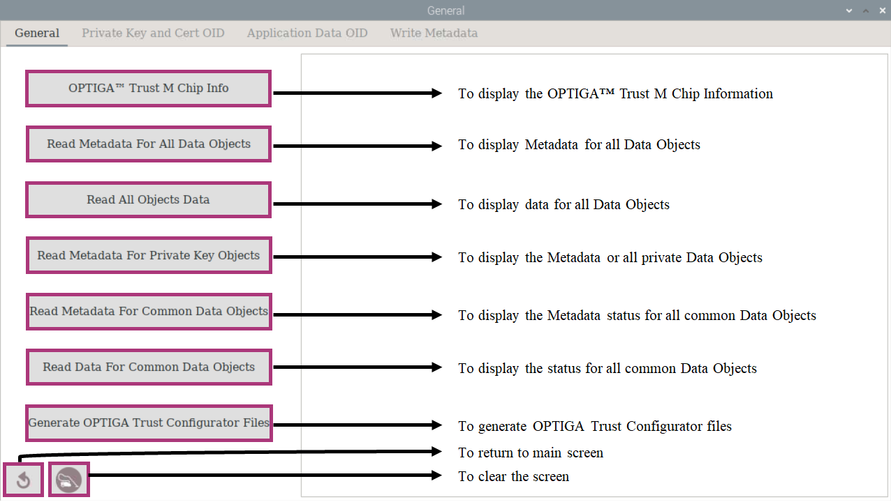
[^Figure 1]: OPTIGA™ Trust M General functions described

### Chip info

Displays the OPTIGA™ Trust M chip information. 

To read out the OPTIGA™ Trust M chip info, select "OPTIGA™ Trust M chip info".

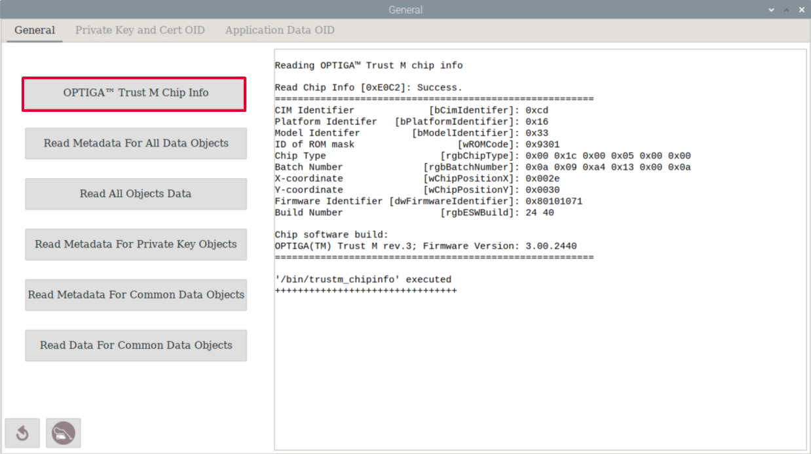

[^Figure 2]: OPTIGA™ Trust M chip info displayed

### Read Metadata For All Data Objects

Displays the metadata for all data objects : *0xE0E0-0xE0E3, 0xE0E8-0xE0E9, 0xE0EF,* *0xE120-0xE123,* *0xE200*, *0xE140, 0xF1D0-0xF1DB, 0xF1E0-0xF1E1*

To read out metadata, select "Read Metadata For All Data Objects".

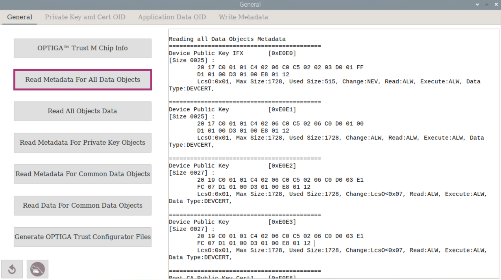
[^Figure 3]: Metadata for all data objects displayed

### Read All Objects Data

To Display the data for all data objects : *0xE0E0-0xE0E3, 0xE0E8-0xE0E9, 0xE0EF,*  *0xE120-0xE123,* *0xE200*, *0xE140, 0xF1D0-0xF1DB, 0xF1E0-0xF1E1*

To read data, select "Read All Objects Data"

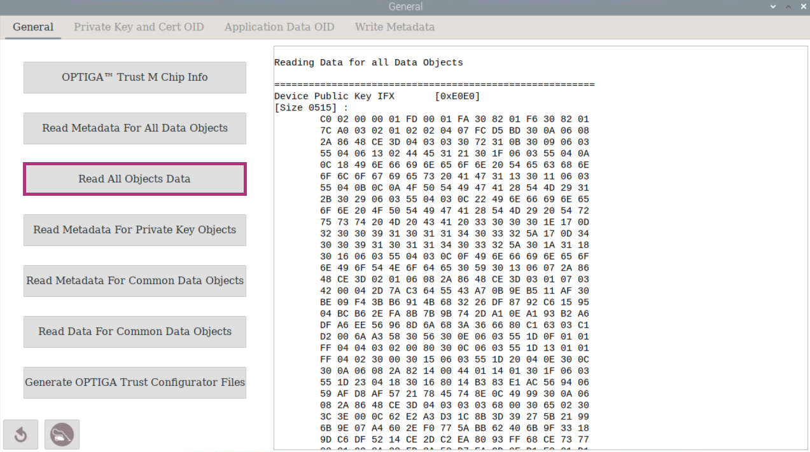

[^Figure 4]:Data of all data objects displayed

### Read Metadata For Private Key Objects

To Display the metadata for all private data objects *: 0xE0F0-0xE0F3,* *0xF1FC-0xE0FD*

To read metadata for private key slot, select "Read Metadata For Private Key Objects"

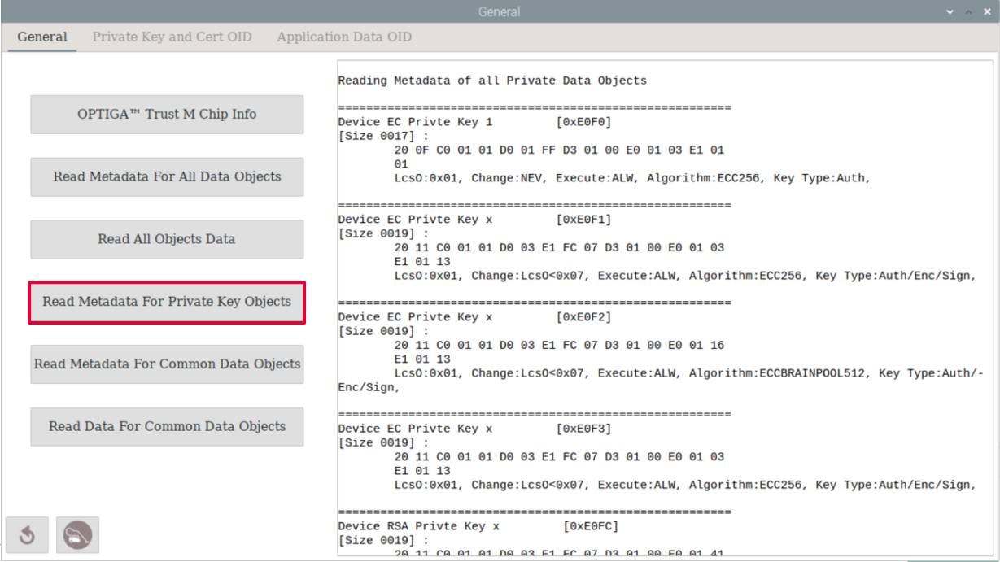

[^Figure 5]:Metadata for private key data objects displayed

### Read Metadata For Common Data Objects

Displays the metadata status of common data objects *: 0xE0C0-0xE0C6,*  *0xF1C0-0xF1C2*

To read metadata status, select "Read Metadata For Common Data Objects".

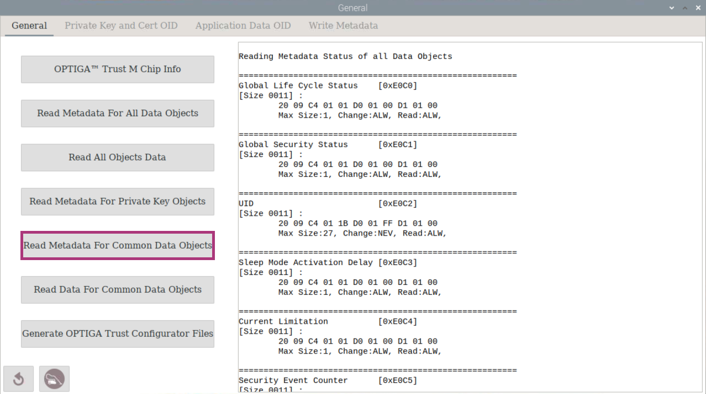

[^Figure 6]:Metadata status for common data objects displayed

### Read Data For Common Data Objects

Displays the status of common data objects *: 0xE0C0-0xE0C6,*  *0xF1C0-0xF1C2*

To read data status, select "Read Data For Common Data Objects". 

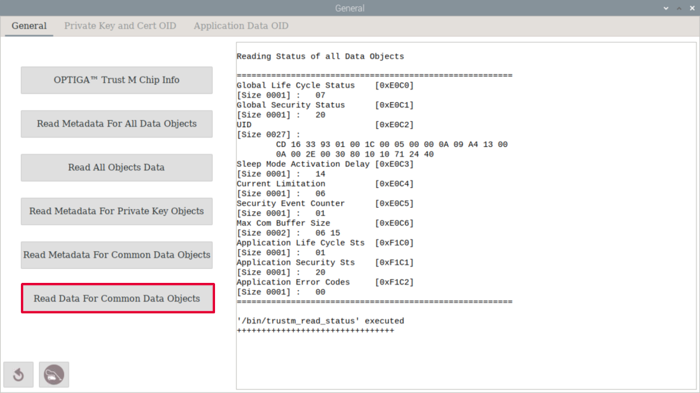

[^Figure 7]:Data Status of common data objects displayed

### Generate OPTIGA Trust Configurator Files

Generates configurations files to be imported to OPTIGA Trust Configurator tool from Infineon.

> **Note**:
> OPTIGA Trust Configurator(OTC) is a tool which can be used to generate customer specific configurations for Infineon Secure Elements. The OTC files generated here can be imported into Infineon OPTIGA Trust Configurator to create custom security chip configurations. Please go to Infineon website to download OPTIGA Trust Configurator for final configuration.

To generate OTC Files, select "Generate OPTIGA Trust Configurator Files"

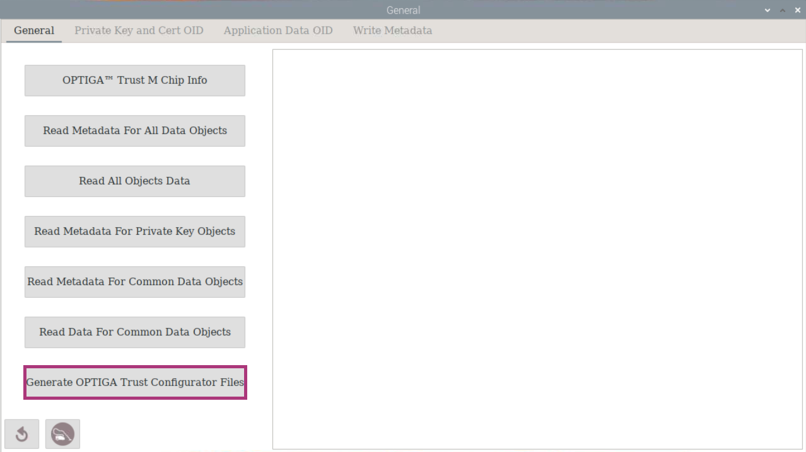
[^Figure 8]: Generate OPTIGA Trust Configurator Files Option


Select directory to save the generated OTC Files in the save file dialog. By default, the generated OTC files are compiled under `OPTIGA_Trust_M_V3_SLS32AIA010ML_K_Infineon_Technologies/` directory

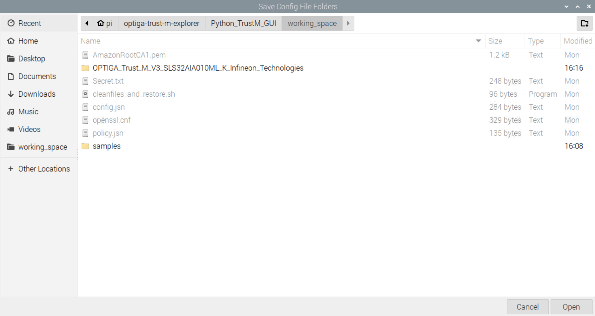
[^Figure 9]: OTC File save dialog

>**Note**:
> OTC Files generation could take up to a minute

After finished, the screen will also show the directory of the generated OTC file

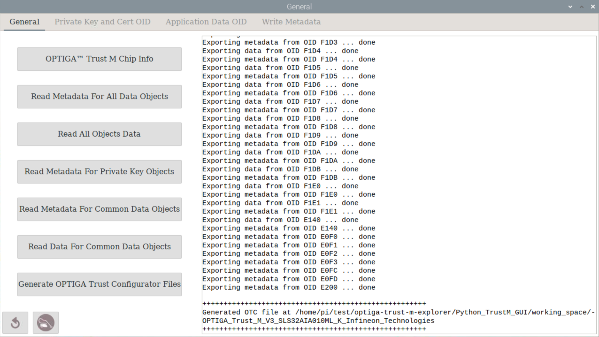
[^Figure 10]: OTC generation completed

## Private Key and Cert OID

This section shows you the Private Key and Certificate OID management of the OPTIGA™ Trust M. It is used to read metadata of the Private keys , read out Certificate metadata, Certificate Data and write Certificate's  into data objects.

### Functions 

Private Key and Cert OID functions Description

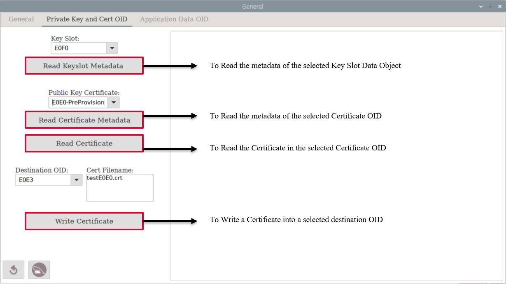

[^Figure 11]:Private Key and Cert OID functions described

### Read Key Slot Metadata

Reads out the Metadata of the selected Key Slot Data Object. Key Slot data objects :*0xE0F0 - 0xE0F3*, *0xE0FC-0xE0FD*, *0xE200*

Key Slot Data Objects are data objects used by the Cryptographic Application. 

To read metadata of the key slot, select the Key Slot. Then select  "Read Key Slot Metadata". In this example Key Slot data object : *0xE0F0*

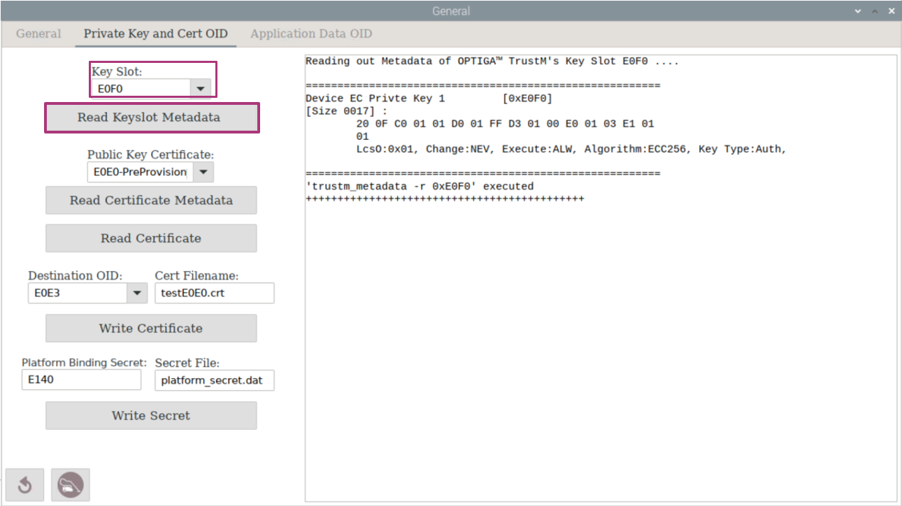

[^Figure 12]:Key slot metadata displayed 

### Read Certificate Metadata

The Public Key Certificate data objects are used to store Certificates. 

To read out metadata of a selected Public key Certificate data object, select "Read Certificate Metadata". In this example, *0xE0E0* is selected 

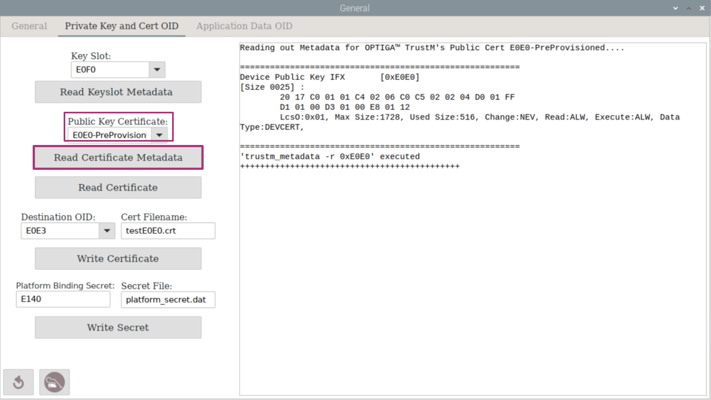

[^Figure 13]:Certificate Metadata displayed 

### Read Certificate

Read the Certificate Data stored inside the selected data objects : *0xE0E0 - 0XE0E3*, *0XE0F8 - 0XE0F9*

To read out the certificate data stored inside, select the Public Key Certificate data object , from the options,  then select "Read Certificate".

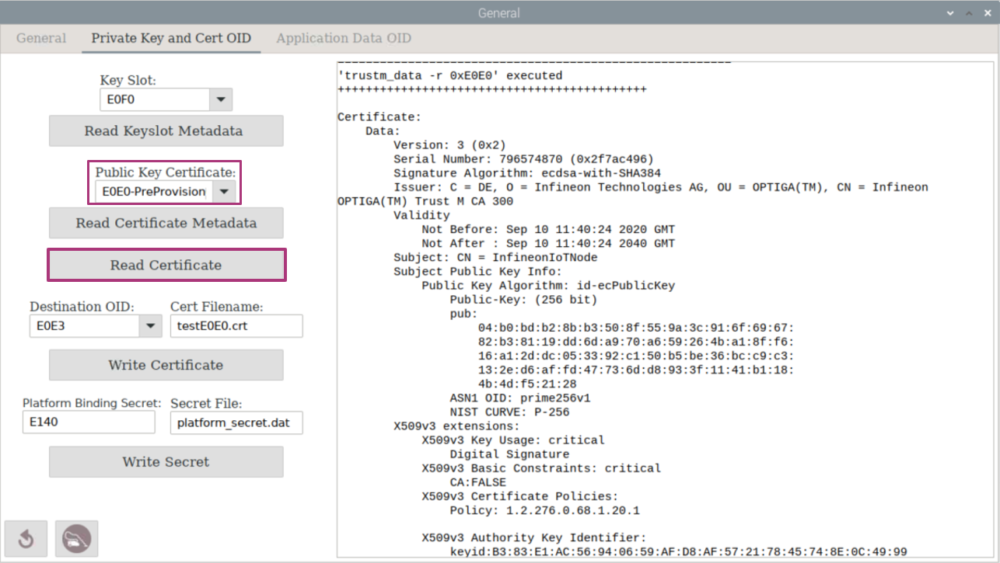

[^Figure 14]:Readout Certificate displayed

### Write Certificate

Write a Certificate into the selected data object : *0xE0E1 - 0xE0E3*, *0xE0E8 - 0XE0E9*

*0xE0E0* is used to store the pre-provisioned certificate from Infineon. *0xE0E8 - 0xE0E9* is used to store the trust anchor. 

To Write Certificate, Select the Certificate filename. In this example, the testE0E0.crt Certificate file is selected.

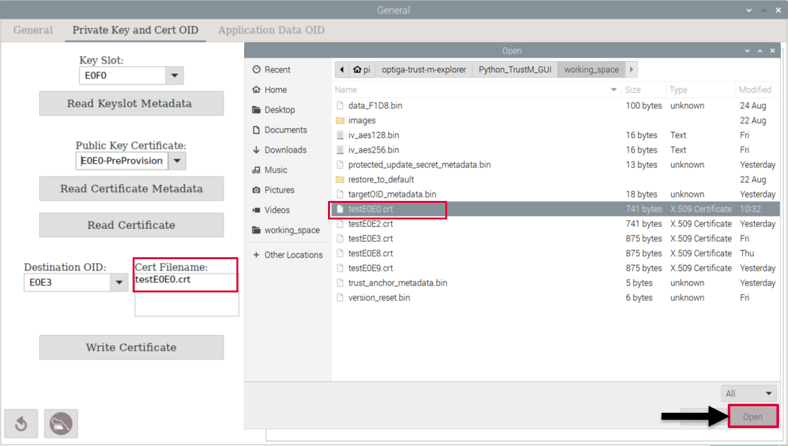

[^Figure 15]:Certificate file selection

Select the Destination OID to write the certificate data. The Destination OID data objects list: *0xE0E1 - 0xE0E3*, *0xE0E8 - 0XE0E9* . In this example *0xE0E3* is selected. 

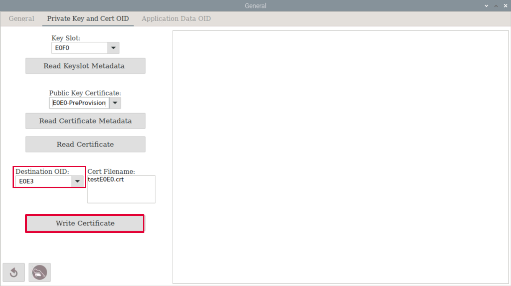

[^Figure 16]:Write Certificate into destination OID

Select "Write Certificate" to write in certificate data into Destination OID.

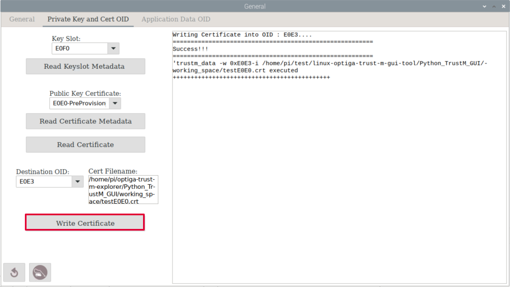

[^Figure 17]:Certificate successfully written into destination OID

### Write Platform Binding Secret

Write the Platform Binding Secret into the Platform Binding Secret Data Object : *0xE140*

To Write Platform Binding Secret, Select the Secret file. In this example, platform_secret.dat is selected as the default one.

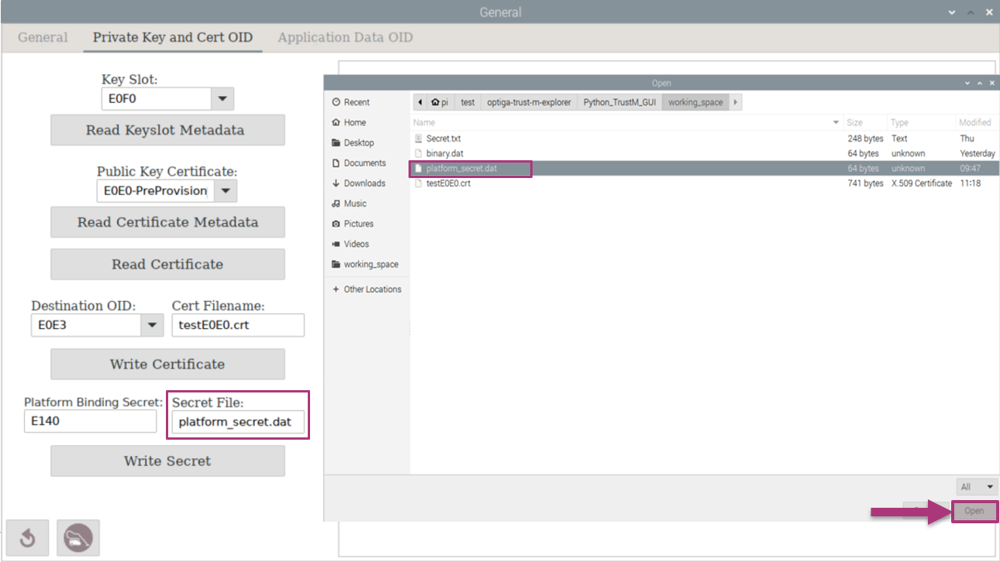

[^Figure 18]: Secret File Selection

Select "Write Secret" to write in the Platform Binding Secret into *0xE140*.

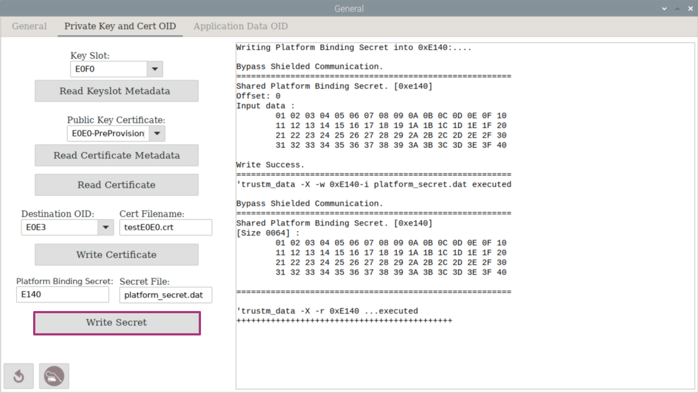

[^Figure 19]: Secret Data successfully written into Platform binding secret data object

## Application Data OID

This section shows you the Application Data Objects management of the OPTIGA™ Trust M. It is used to read metadata, data of the Application Data Objects and write data into Application Data Objects 

Application data objects are the data objects used by the Protected Update and Secure Storage Applications.

### Functions 

Application Data OID functions description

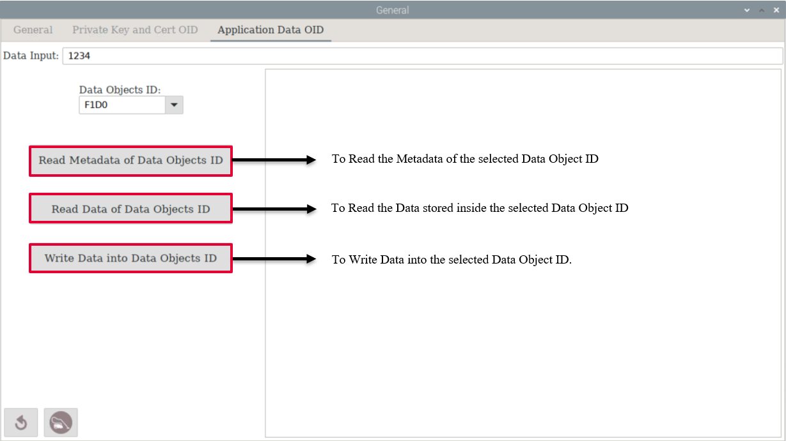

[^Figure 20]:Application Data OID functions described

### Read Metadata Of Data Objects ID

Reads the Metadata of the selected Application Data Object.  Data Objects ID : *0xF1D0 - 0xF1DB* 

To Read Metadata, select Data Objects ID . Then select "Read Metadata of Data Objects ID". In this Example Data Objects ID: *0xF1D0* is used.

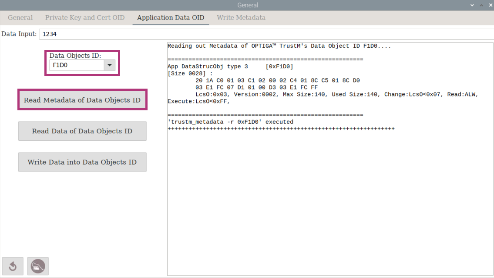

[^Figure 21]:Metadata of data objects ID: *0xF1D0* displayed

### Read Data of Data Objects ID 

Reads the Data stored inside the selected Application Data Object ID.

To Read Data, select Data Objects ID . Then select "Read Metadata of Data Objects ID". In this Example Data Objects ID: *0xF1D0* is used.

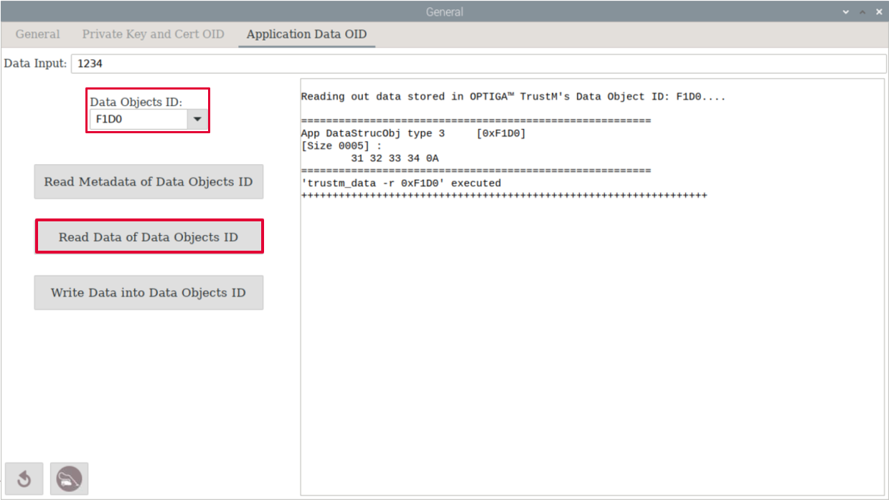

[^Figure 22]:Data inside data objects ID: *0xF1D0* is Read out

### Write Data Into Data Objects ID

Write Data into the selected Data Object ID. 

To Write Data, enter the Data input and select the Data Object ID to write to. Then click " Write Data into Data Objects ID". For this example *0xF1D0* is selected and the data input is "1234".

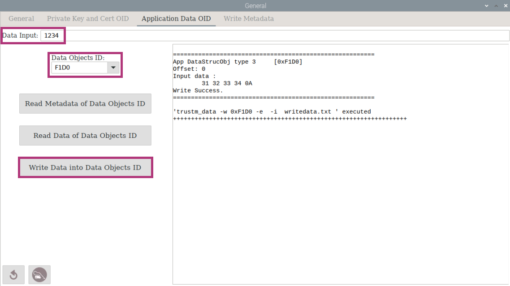

[^Figure 23]:Write Input Data into data object ID: *0xF1D0* successfully


## Write Metadata

This section shows you the Metadata management of the OPTIGA™ Trust M. It is used to read and write metadata to all Data Objects.

Data Objects available for Metadata write include Public and Private Keys, Certificates, System Data Objects, Counter Objects, Platform Binding Secrets and Application Data Objects.


### Functions

Write metadata functions description

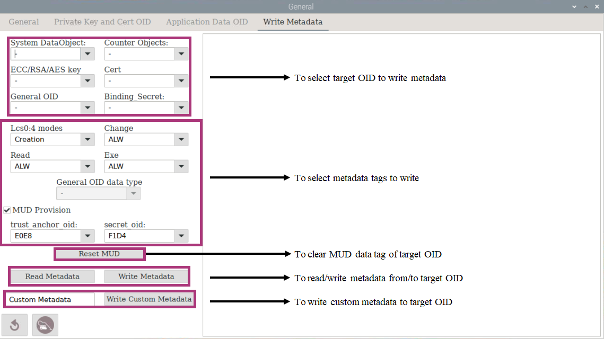
[^Figure 24]: Write Metadata functions described

### Read Metadata
Read Metadata from specified Object ID

To read metadata from an Object ID, select one Object ID from the six types of the Data Objects to read from, then click "Read Metdata". For this example *0xF1D0* is selected

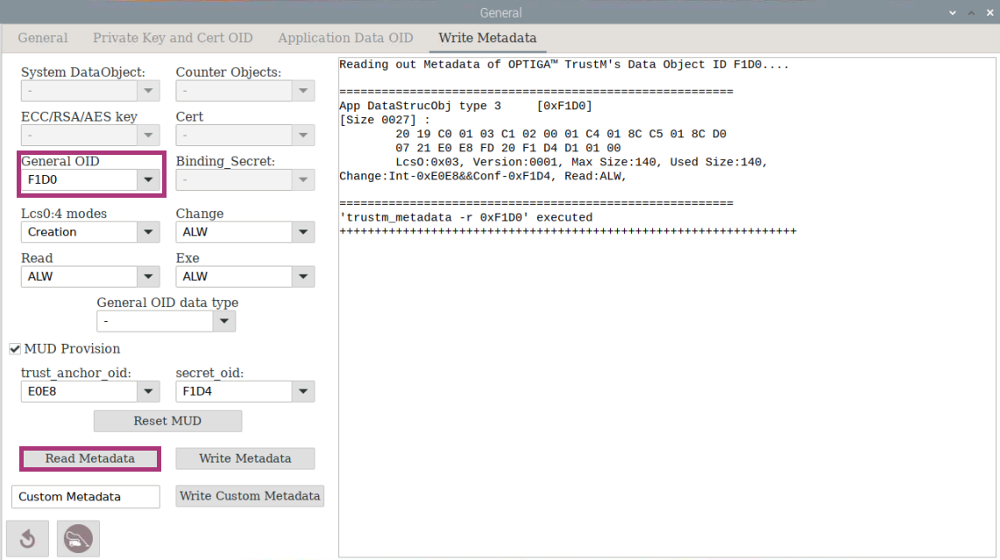
[^Figure 25]: Read Metadata from Object ID 0xF1D0

### Write Metadata
Write Metadata to specified Object ID

To write metadata to an Object ID, select target OID from one of the lists, configure metadata tags then click *Write Metadata* button. In the example, <br>
- Target OID *0xF1D5* is selected 
- *Lcs0* is *Creation* (0x01)
- *Change* is *Lcs0<0x07*
- *Read* is *Lcs0<0x0F*
- *Exe* is *Lcs0<0x07*
- *data type* is Bytestring (BTSR)

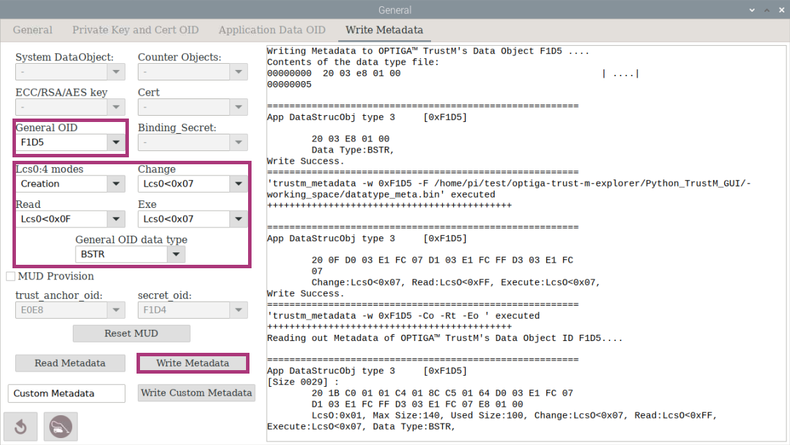
[^Figure 26]: Metadata update for OID 0xF1D5 successful


> **Note**:
> To prevent ***Lcs0*** values being irreversible, ***MUD Provision*** checkbox will be enabled by default when *Lcs0* mode is ***Operational*** or ***Termination*** <br>

> To revert changes to *Lcs0* tag, please see section [*5.1 Metadata Protected Update*](#metadata-protected-update) 

### Reset MUD
Reset Metadata Update Description (MUD) tag

To reset MUD, select target OID from one of the list, then click *Reset MUD* <br>
In the example, OID 0xF1D5 has MUD tag `MUD:Int-0xE0E8&&Conf-0xF1D4`. After Reset MUD, the tag field is `MUD:NEV`

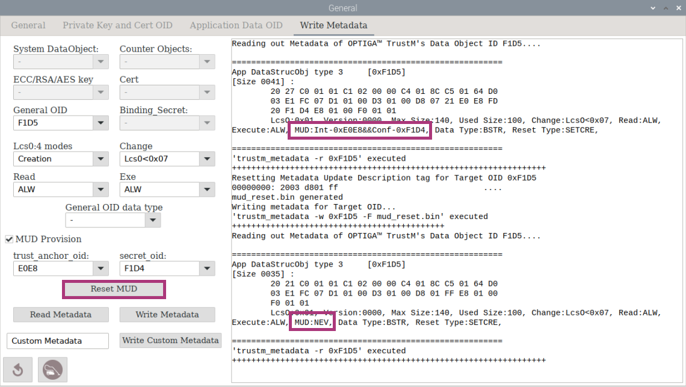
[^Figure 27]: MUD Reset Successful

### Write Custom Metadata
Write metadata to target OID based on user's text file

To load custom metadata into target OID
- Select target OID from one of the lists
- Click the *Custom Metadata* text box to choose custom metadata file
- Double check the metadata contents to be written
- Click *Write Custom Metadata*

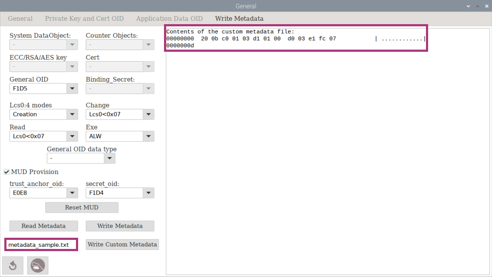
[^Figure 28]: custom metadata loaded and contents shown

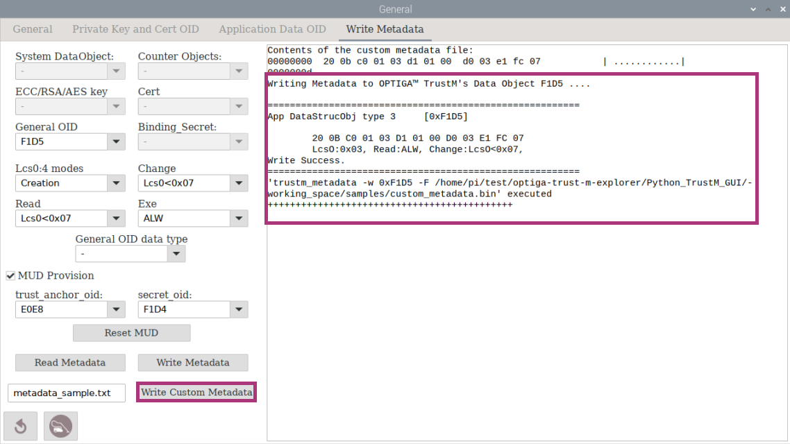
[^Figure 29]: custom metadata write success

## Matter DAC Provisioning
This section shows you the DAC Provisioning for Matter devices using the OPTIGA™ Trust M. It involves reading a pre-provisioned certificate from the chip, extracting the public key, generating a new DAC certificate signed by a trusted Matter CA and writing the DAC certificate, Matter Test PAI and Test CD into the Object IDs.

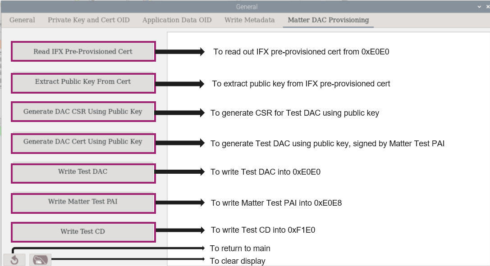
[^Figure 30]: Matter DAC Provisioning functions described

### Read Pre-Provisioned Cert
Reads IFX pre-provisioned certificate from OID 0xE0E0

To read the IFX pre-provisioned certificate, select "Read IFX Pre-Provisioned Cert".
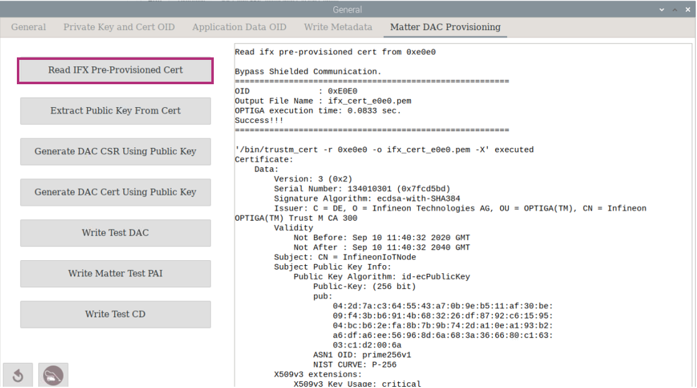
[^Figure 31]: Displays information about the pre-provisioned certificate

### Extract Public Key From Cert
Extracts the public key from the certificate and saves it to a file named pubkey_e0e0.pem.

To extract the public key from the certificate, select "Extract Public Key From Cert".
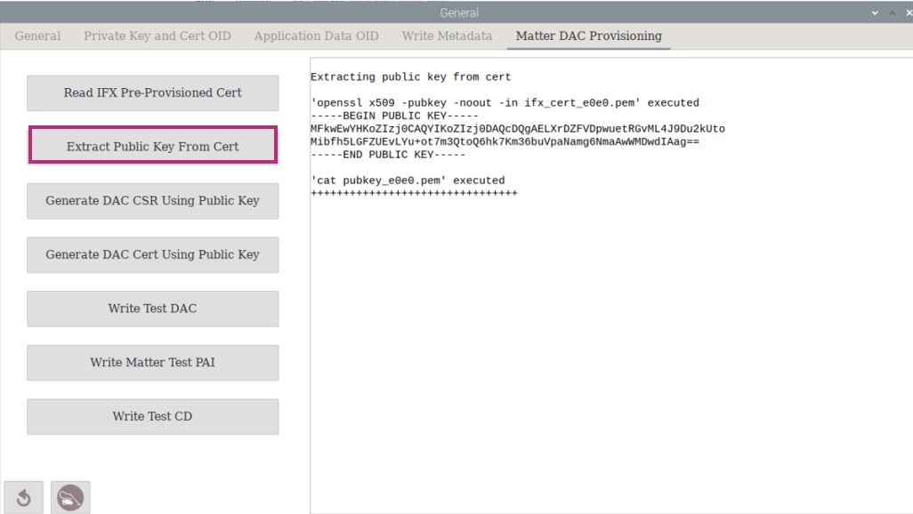
[^Figure 32]: Displays the public key extracted from the certificate

## Generate DAC CSR
Generates a Certificate Signing Request(CSR) using the public key.

To generate the CSR, select "Generate DAC CSR Using Public Key".
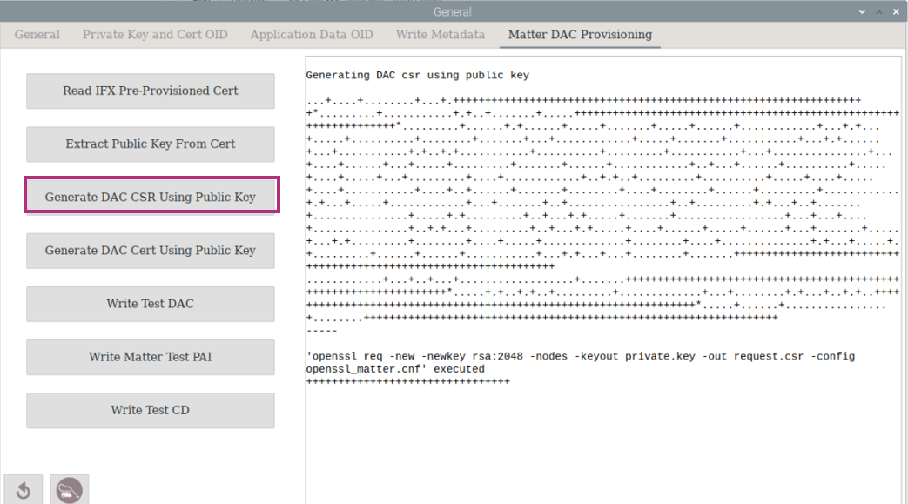
[^Figure 33]: CSR generated from the public key

### Generate DAC Cert
Generates a new DAC certificate by signing the CSR with the Matter Test PAI certificate.

To generate the certificate, select "Generate DAC Cert Using Public Key".
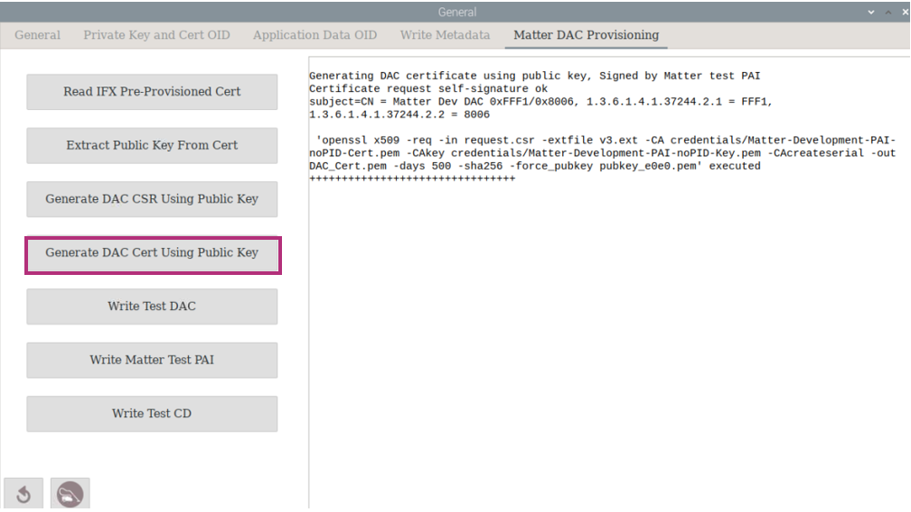
[^Figure 34]: DAC certificate generated from the public key

### Write DAC Cert
Writes the new DAC certificate to OID 0xE0E3.
To write the new DAC certificate into 0xE0E3, select "Write Test DAC".
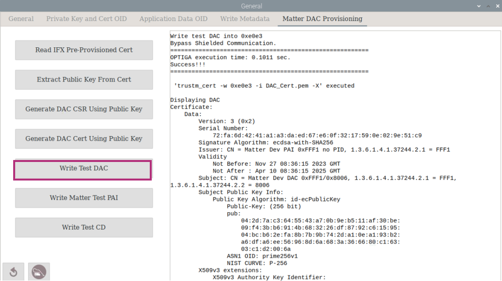
[^Figure 35]: Displays information of the new DAC certificate

### Write Matter Test PAI
Writes the Matter Test PAI certificate to OID 0xE0E8.
To write the Matter Test PAI into 0xE0E8, select "Write Matter Test PAI".
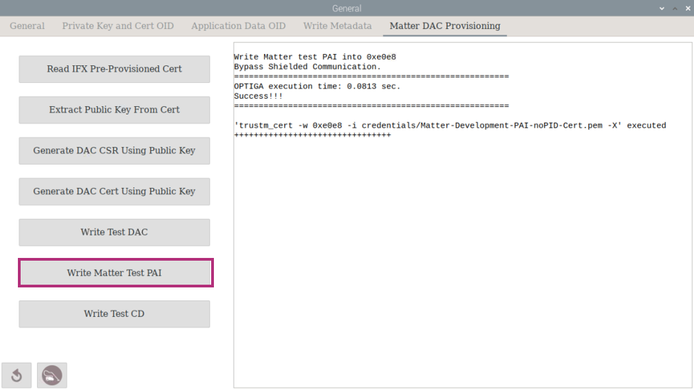
[^Figure 36]: Matter Test PAI written to 0xE0E8.

### Write Test CD
Writes the Test CD to OID 0xF1E0.
To write Test CD into 0xF1E0, select "Write Test CD".
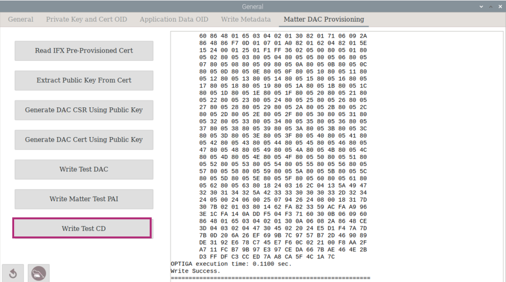
[^Figure 37]: Test CD written to 0xF1E0.

# Cryptographic Functions

This section shows you the Cryptographic Functions of the OPTIGA™ Trust M. It can be used to generate keys , encrypt/decrypt and sign/verify using Trust M library.

## ECC Cryptographic Function

This section shows the use of the  OPTIGA™ Trust M ECC Cryptographic functions such as ECC key generation, ECC sign and verify.

Select "ECC"

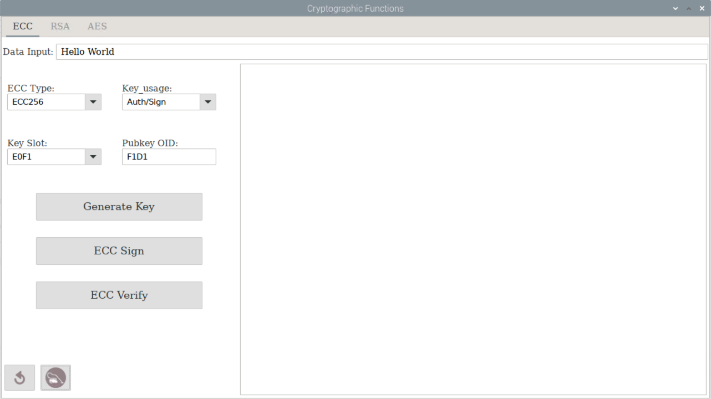

[^Figure 38]: Cryptographic Functions ECC menu screen

### ECC Functions

ECC function Description

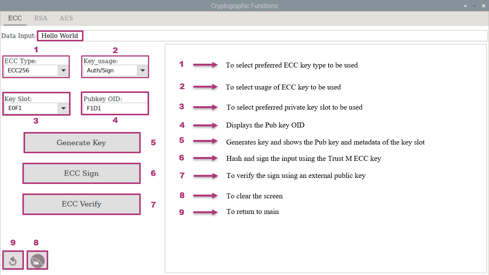

[^Figure 39]: ECC cryptographic functions described

### ECC Key Generation

Generates OPTIGA™ Trust M ECC key pair. 

ECC type is the ECC Key type to be generated. Key slot is the OID that will be used to store the private key . Once key slot is selected, the public key OID will be displayed. The public key OID will be used to store the public key of the ECC keypair after it is generated.

ECC Types : *ECC 256, ECC 384, ECC 521*, *Brainpool 256, Brainpool 384 ,Brainpool 512* ,  Key Slot : *0xE0F0 - 0xE0F3*  

To generate ECC key pair, select the ECC type, Key slot and Key_usage. Then select "Generate Key"  In this Example, "*ECC type: 256*" ,"*Key slot: E0F1*" and "*key_usage:Auth/Sign*" are used. The public Key will be stored into corresponding OID which has been displayed in the GUI. 

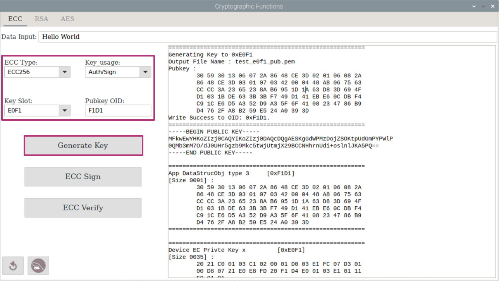

[^Figure 40]: ECC256 key inside 0xE0F1 generated successfully 

### ECC Sign

Hashes and signs the input using the OPTIGA™ Trust M ECC keypair

To Sign the data using ECC , select ECC type and key slot then click "ECC Sign" . In this Example, "ECC type: 256" and "Key slot: E0F1" are used. 

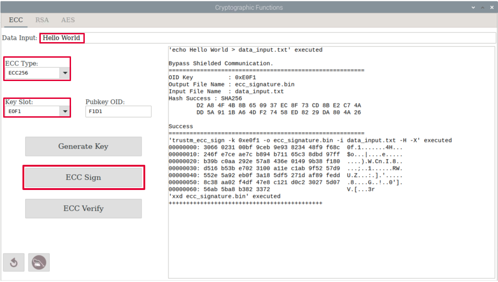

[^Figure 41]: ECC 256 key signed successfully

### ECC Verify

To verify the signature using the public key generated, select the ECC type and key slot to verify.  In this Example, "ECC type: 256" and "Key slot: E0F1" are used.

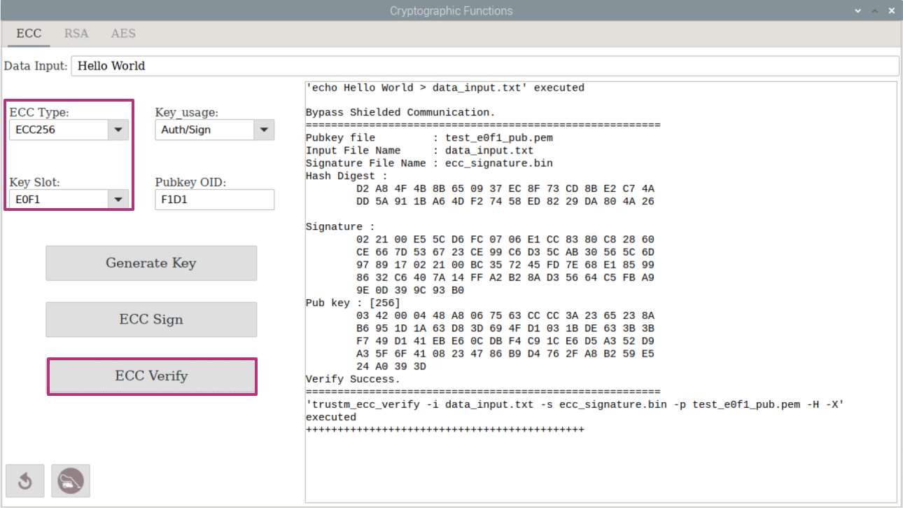

[^Figure 42]: ECC verification done successfully

### ECC Errors

The following error messages will be displayed if the verification failed.

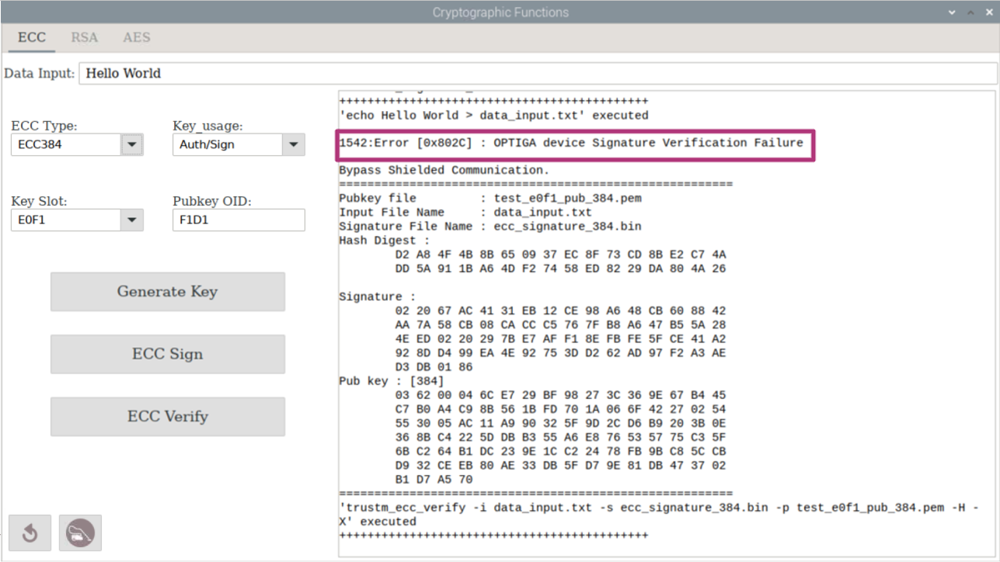

[^Figure 43]: ECC verification failure

## RSA Cryptographic Functions

This section shows RSA1024/2048 Key Generation, Data Encryption and Decryption using RSA key generated by OPTIGA™ Trust M.

Open the "Cryptographic Functions" Tab

Select 'RSA'

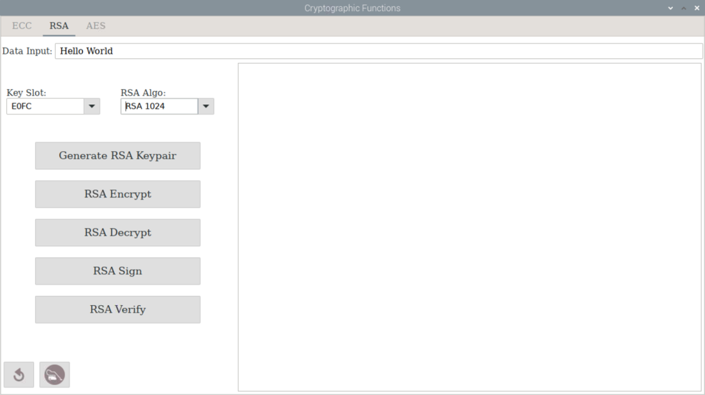

[^Figure 44]: RSA cryptographic function menu screen

### RSA Functions

RSA Functions Description

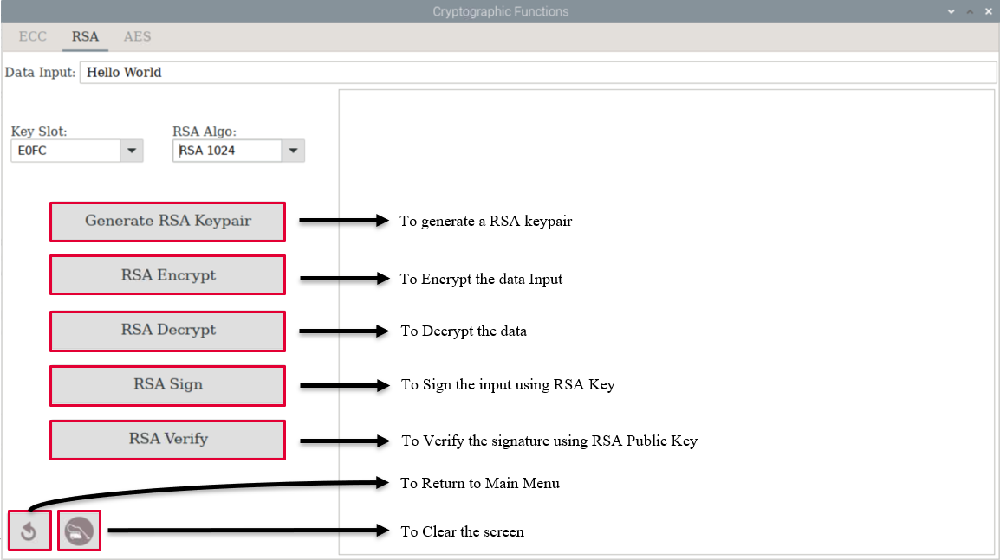

[^Figure 45]: RSA cryptographic functions described

### RSA Key Generation

Generates OPTIGA™ Trust M RSA key pair

RSA Algo is the RSA Key algorithm to be used to generate the keypair. Key slot is the OID that will be used to store the private key after key generation. 

RSA Algo : *RSA 1024, RSA 2048* . Key Slot : *0xE0FC, 0xE0FD*

To generate RSA keypair, select the RSA Algo, Key slot and Key_usage. Then select "Generate RSA keypair" . In this example RSA Algo: *RSA 1024*, key slot: *0xE0FC* and key_usage:Auth/Enc/Sign are used.The public Key will be stored into corresponding OID which has been displayed in the GUI. 

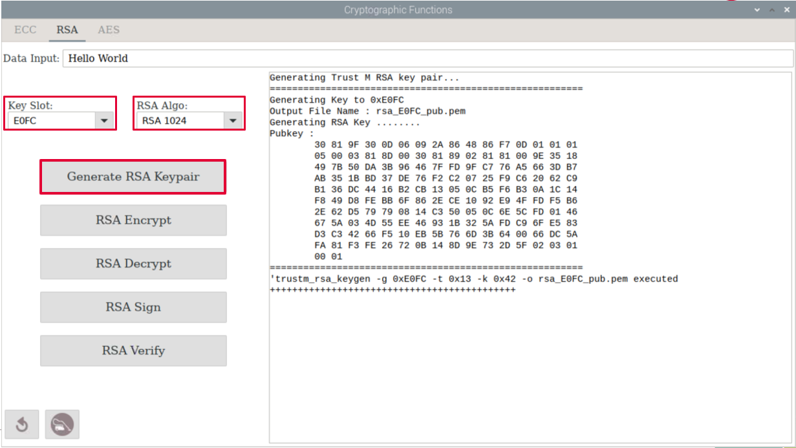

[^Figure 46]:RSA key generated successfully in key slot:*0xE0FC* (RSA 1024)

### RSA Encryption

Encryption using OPTIGA™ Trust M RSA Public key

To Encrypt the input data using RSA, enter the data in "Data Input". Then select "RSA Encrypt " to encrypt the message. 

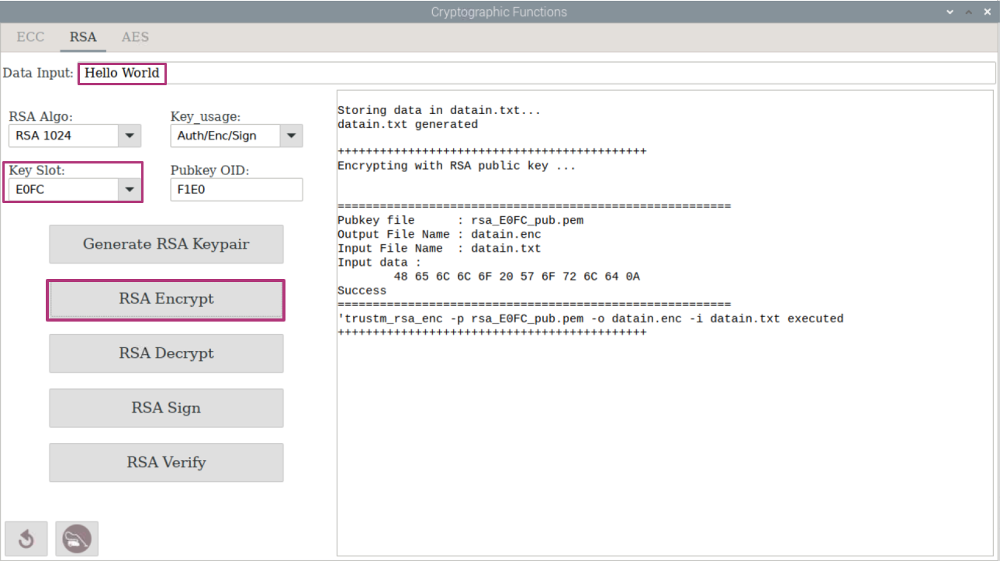

[^Figure 47]: Encrypted using RSA public key

###      RSA Decryption

Decryption using OPTIGA™ Trust M RSA Private key

To Decrypt the message, Select "RSA Decrypt"  to decrypt and display the decrypted message.

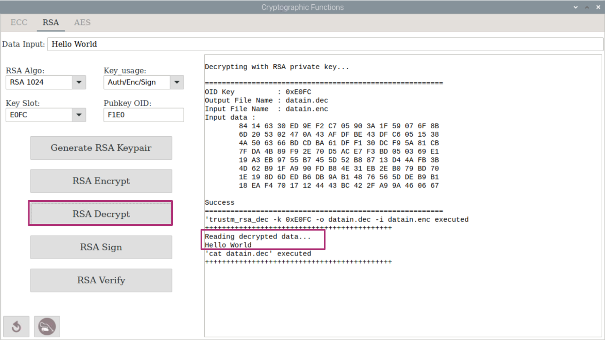

[^Figure 48]: Decrypted using private key

### RSA Sign

Hashes and signs the input using the OPTIGA™ Trust M RSA keypair

To Sign the input data using RSA , select RSA Algo and key slot to sign. In this Example, "RSA Algo: 1024" and "Key slot: E0FC" are used. 

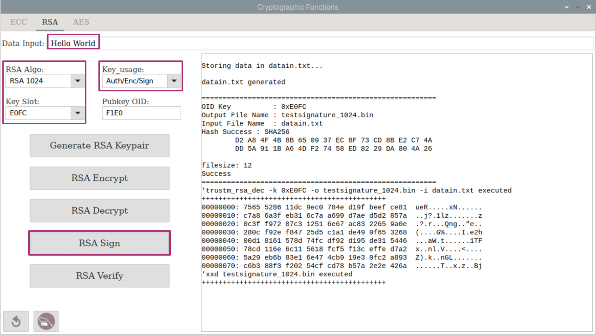

[^Figure 49]:Data input signed using RSA key

### RSA Verify

Verifies the signature using the public key generated.

To verify using RSA, select the RSA Algo and key slot to verify.  In this Example, "RSA Algo: 1024" and "Key slot: E0FC" are used.

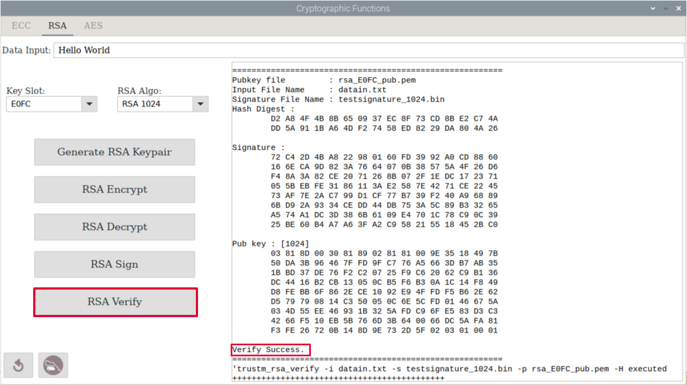

[^Figure 50]:Signature verified 

## AES Cryptographic Function

This section shows the use OPTIGA Trust M Symmetric Key Gen Functions as well the AES Encryption and Decryption for the Symmetric key.  

Open the "Cryptographic Functions" Tab

Select 'AES'

### Functions

AES Functions Description


[^Figure 51]: AES cryptographic functions described

### AES Key Generation

Generates OPTIGA™ Trust M AES symmetric key.

AES Key is to select the AES key type to be generated.  Supported AES Key:  *AES 128, AES 192, AES 256*  Key_usage is  to select the usage for the generated AES key.

To generate AES symmetric key, Select the AES Key and Key_usage.  then select "Generate AES key".


[^Figure 52]: AES 128 symmetric key generated 

### AES Encryption

Encryption of the input data using AES Key generated by OPTIGA™ Trust M

To Encrypt the input text data using AES key, first **de-select** the "Use Data File Input" checkbox, then enter the data in "Data Input". Click "IV File" text box to select desired Initialization file. Then select "AES Encrypt " to encrypt the message. The AES CBC mode is using here for AES Encryption and Decryption.


[^Figure 53]: Text data input encrypted using AES key

To Encrypt the input custom data using AES key, first **select** the "Use Data File Input" checkbox, then click "Custom Data File" textbox to select data file to encrypt. Click "IV File" text box to select desired Initialization file. Then select "AES Encrypt " to encrypt the data file.


[^Figure 54]: Custom data input encrypted using AES CBC Mode

### AES Decryption

Decryption of the input data using AES key generated by OPTIGA™ Trust M 

To Decrypt the message, Select "AES Decrypt" to decrypt and display the decrypted message. The decrypted message is also available at `working_space/mydata.txt.dec`


[^Figure 55]: Data Input decrypted using AES CBC Mode

# OpenSSL Provider

This section shows you the OpenSSL-Provider functions of the OPTIGA™ Trust M . The OpenSSL-Provider can be used to create RSA(Client/Server) and can also be used for random number generation.

## ECC (Client/Server)

The ECC(CLient/ Server) is a demonstration to show the use of the Trust M Provider for secure communications between client and server

Select "ECC (Client/Server)"


[^Figure 56]: OpenSSL-Provider ECC (Client/Server) Menu Screen

## ECC (Client/Server) Function Description

ECC (Client/Server) Functions described


[^Figure 57]: OpenSSL-Provider ECC (Client/Server) Function Description part 1


[^Figure 58]: OpenSSL-Provider ECC (Client/Server) Function Description part 2

### ECC Create Server Certificate

Generate private key and CSR for server.

Select "Create Server Private Key and CSR"


[^Figure 59]: OpenSSL-Provider ECC (Client/Server) Create Private Key and Certificate Signing Request (for server)

Generate Server Certificate using Certificate Authority

Select "Create Server Cert"


[^Figure 60]: OpenSSL-Provider ECC (Client/Server) Create Server Cert

### ECC Create Client Certificate

Generate ECC Key and CSR for client.

Select "Create Client ECC Key and CSR"


[^Figure 61]: OpenSSL-Provider ECC (Client/Server) Create Client ECC key and CSR

Generate Client Certificate using Certificate Authority

Select "Create Client Cert"


[^Figure 62]: OpenSSL-Provider ECC (Client/Server) Create Client Certificate

### ECC Start an OpenSSL Server

Starting an OpenSSL server

Start an OpenSSL S_Server instance by selecting "Start/Stop Server"  


[^Figure 63]: OpenSSL-Provider ECC (Client/Server) Start Server

### ECC Start an OpenSSL Client

Start an OpenSSL Client

Start an OpenSSL Client and connect  with OpenSSL Server by selecting "Start/Stop Client"


[^Figure 64]: OpenSSL-Provider ECC (Client/Server) Start Client

### ECC Secure data exchange between Server and Client

Messages can be sent from Server to Client as well as Client to Server by entering input in the boxes below and selecting "Write to Client" or "Write to Server".  The message "Hello from Server" and "Hello from Client" has been successfully sent


## RSA (Client/Server)

The RSA(Client/Server) is a demonstration to show the use of the Trust M for secure communications between client and server.

Select "RSA (Client/Server)"


[^Figure 65]: OpenSSL-Provider RSA (Client/Server) Menu Screen

## RSA (Client/Server) Function Description

RSA (Client/Server) Functions described


[^Figure 66]: OpenSSL-Provider RSA (Client/Server) Function Description part 1


[^Figure 67]: OpenSSL-Provider RSA (Client/Server) Function Description part 2

### RSA Create Server Certificate

Generate private key and CSR for server.

Select "Create Server Private Key and CSR"


[^Figure 68]: OpenSSL-Provider RSA (Client/Server) Create Private Key and Certificate Signing Request (for server)

Generate Server Certificate using Certificate Authority

 Select "Create Server Cert"


[^Figure 69]: OpenSSL-Provider RSA (Client/Server) Create Server Cert

### RSA Create Client Certificate

Generate RSA Key and CSR for client.

Select "Create Client RSA Key and CSR"


[^Figure 70]: OpenSSL-Provider RSA (Client/Server) Create Client RSA key and CSR

Generate Client Certificate using Certificate Authority

Select "Create Client Cert"


[^Figure 71]: OpenSSL-Provider RSA (Client/Server) Create Client Certificate

### RSA Start an OpenSSL Server

Starting an OpenSSL server

Start an OpenSSL S_Server instance by selecting "Start/Stop Server"  


[^Figure 72]: OpenSSL-Provider RSA (Client/Server) Start Server

### RSA Start an OpenSSL Client

Start an OpenSSL Client

Start an OpenSSL Client and connect  with OpenSSL Server by selecting "Start/Stop Client"


[^Figure 73]: OpenSSL-Provider RSA (Client/Server) Start Client


### RSA Secure data exchange between Server and Client

Messages can be sent from Server to Client as well as Client to Server by entering input in the boxes below and selecting "Write to Client" or "Write to Server".  The message "Hello from Server" and "Hello from Client" has been successfully sent as shown in Figure 71


[^Figure 74]: OpenSSL-Provider RSA (Client/Server) Communication


## Random Number Generator

This section shows to use OpenSSL libraries to generate random number based on Encoding type hex or base64  with indicated number of bytes to be generated.

Open the OpenSSL-Provider In Main 

Select "RNG".


[^Figure 75]: OpenSSL RNG Menu Screen

To change the bytes generated, enter the input in "No. of bytes to be generated". 

To generate random number, enter the "No. of bytes to be generated" and select the encoding type. Then select "Generate RNG" to generate random number. 


[^Figure 76]: Generate RNG

In this example, the numbers generated are 1024 bytes in base64 encoding.


[^Figure 77]: RNG generated 


# Protected Update

This section shows the use of the  OPTIGA™ Trust M Integrity and Confidentially Protected Update for metadata of target OID  and ECC/AES/RSA Key of target key OID by using the Trust Anchor and Secret installed in the OPTIGA™ Trust M


[^Figure 78]: OPTIGA Trust M Explorer Application: Protected Update Selection

# Metadata Protected Update

This section shows the use of the  OPTIGA™ Trust M Integrity and Confidentially Protected Update for metadata of target OID by using the Trust Anchor and Secret installed in the OPTIGA™ Trust M.

1. Select "Protected Update"
2. Overview of the "Metadata Update" tab.


[^Figure 79]: Overview of "Metadata Update" Screen

## Metadata Protected Update Functions

Description of the Steps to do a successful Protected Update of Trust M objects

### Step 1 (Provisioning for All OIDs)

For Step 1, There are two options, Wipe target data and Keep Target data.  For Wipe target data, the target OID Lcs0 will be set to Initialization mode (0x03) and the reset type will be set to 0x11 (SETCRE/FLUSH). For Keep target data, the target OID Lcs0 will be set to Initialization mode (0x03) and the reset type will be set to 0x01 (SETCRE).

For both options, the "Trust anchor OID" is used to store the trust anchor and the data object type is set to Trust Anchor. The Protected Update Secret is written to the data object of "Secret OID " and the Data type will be set to UPDATESEC . The metadata of target OID will be set according during Provisioning. 

Trust Anchor OID options: *0xE0E8 - 0xE0E9*, *0xE0EF* , Target OID options: *0xE0E1 - 0xE0E3, 0xF1D0 - 0xF1DB,0xE0F1 - 0xE0F3,0xE0FC - 0xE0FD, 0xF1E0-0xF1E1*

Secret OID options: *0xF1D0, 0xF1D4 - 0xF1DB*

In this example we will Provision for all OIDs (Wipe TargetData). Select "Step1: Set Lcso=0x03(Init) ResetType=0x01(Keep TargetData)" and also the OIDs for "Trust anchor OID", "Target OID" and "Secret OID".

Choose the trust_anchor_cert which will be stored inside the "Trust anchor OID"  and also the secret file which will be stored inside the "Secret OID"

To Provision,  Select "Step1: Provisioning for All OIDs". 


[^Figure 80]: Provision Data Objects (for Keep TargetData)

After provisioning,  we can press "Read Objects Metadata" button to read out the the metadata for all the OIDs involved.


[^ Figure 81]: Read objects Metadata after provisioning

In this example, the *MUD* for target OID should be *int-0xE0E8&&Conf-0xF1D4* after provisioning. 

### Step 2 (Generate the Manifest and Fragment)

Generate the manifest and fragment for the metadata Protected Update.

To generate the Manifest and fragment, Enter the "payload version" 

Note: the number for payload version must be larger than the current version number.

Choose the trust_anchor_privkey (Corresponding to trust_anchor_cert)and also the secret file (same with the secret stored inside  "Secret OID")

Select the "Step2 : Generate Manifest" button.  In this example the "payload version" is set to 1 and metadata used is the metadata.txt file. 

The Manifest and Fragment Generation are based on all the input inside the red box. For more information for this part, refer to  [protected update data set](https://github.com/Infineon/linux-optiga-trust-m/tree/development_v3/ex_protected_update_data_set) .


[^Figure 82]: Manifest and Fragment generated 

### Step 3 Protected Update for the metadata of Target OID

Protected Updates for the metadata of the target OID

To Update the metadata of the target OID, Select "Step3: Update Trust M Objects". 

 

[^Figure 83]: Metadata protected update 

### Read Objects Metadata

Displays the metadata of the "Trust Anchor OID", "Target OID" and "Secret OID".

To read out metadata , select "Read Objects Metadata".


[^Figure 84]: Objects metadata displayed

After successful metadata protected update, the Lcs0 will be brought back to 0x01, and version will be increased to 0001 from 0000.

### Reset Access Condition

Reset the Access Condition of the Target OID to *MUD:NEV* so that the Target OID is able to be back to initial MUD state for use in other features after a successful Protected Update and not locked. 


[^Figure 85]: Target OID access condition reset successfully

# ECC Key Protected Update

This section shows the use of the  OPTIGA™ Trust M Integrity and Confidentially Protected Update for ECC Key OIDs by using the Trust Anchor and Secret installed in the OPTIGA™ Trust M.

1. Select "ECC Key Update"
2. Overview of the "ECC Key Update" tab.


[^Figure 86]: ECC key Protected Update Screen

## ECC Key Protected Update Functions

Description of the Steps to do a successful Protected Update of OPTIGA™ Trust M ECC Key Data Objects.

### ECC: Step 1 (Provisioning for All OIDs)

For Step 1, the "Trust anchor OID" is used to store the trust anchor and the data object type is set to Trust Anchor. The Protected Update Secret is written to the data object of "Secret OID " and the Data type will be set to UPDATESEC . The metadata of target OID will be set according during Provisioning. 

Trust Anchor OID options: *0xE0E8 - 0XE0E9* , Target OID options: *0xE0F1 - 0xE0F3,*

Secret OID options: *0xF1D0, 0xF1D4 - 0xF1DB*

In this example we will Provision for all OIDs. Select the "Trust anchor OID", "Target OID", "Secret OID". Then select the secret file to be used to store into the Secret OID and the Trust anchor Cert file to be used to store into trust anchor OID by clicking the respective textboxes. 


[^Figure 87]:Selection of Trust Anchor Certificate and Input Secret file

To Provision,  Select "Step1: Provisioning for All OIDs". 


[^Figure 88]:Provisioning for ECC key Protected Update

In this example, after provisioning, the access condition *change* of target OID should be set to *Int-0xE0E8&&Conf-0xF1D4*

### ECC: Step 2 (Generate Manifest and Fragment)

Generate the manifest and fragment for the ECC key Protected Update.

To generate the Manifest and fragment, Enter the "payload version" and select the "privkey_data" and "pubkey_data" file you want to store into OPTIGA™ Trust M.

Choose the trust_anchor_privkey (Corresponding to trust_anchor_cert)and also the secret file (same with the secret stored inside  "Secret OID")

Select the "Step2 : Generate Manifest" button.  

In this example the "payload version" is set to 1 and the payload_type is  key. The private key data used is the ecc256test_priv.pem file and the corresponding public key data is stored in the ecc256test_pub.der file. The private key used is sample_ec_256_priv.pem file and the secret used is secret.txt file.

The Manifest and Fragment Generation are based on all the input inside the box. For more information for this part, refer to  [protected update data set](https://github.com/Infineon/linux-optiga-trust-m/tree/development_v3/ex_protected_update_data_set) 


[^Figure 89]: ECC Key Manifest and Fragment generated 

### ECC: Step 3 Protected Update for the ECC Key 

Protected Updates the ECC key data into the target OID

To Update the ECC key into target OID, Select "Step3: Update Trust M Objects". 


[^Figure 90]:ECC Key Protected Update successfully

### Read ECC key Objects Metadata 

Displays the metadata of the "Trust Anchor OID", "Target OID" and "Secret OID".

To read out metadata , select "Read Objects Metadata".


[^Figure 91]:Read out object metadata

### Reset ECC Key Access Condition

Resets the Access Condition of the Target OID *Change* to *LCS <0x07* so that the Target OID will be accessible for use in other features after a successful Protected Update and not locked.


[^Figure 92]:ECC Key OID access condition reset successfully

# AES Key Protected Update

This section shows the use of the  OPTIGA™ Trust M Integrity and Confidentially Protected Update for AES Key OIDs by using the Trust Anchor and Secret installed in the OPTIGA™ Trust M.

1. Select "AES Key Update"

2. Overview of the "AES Key Update" tab. 


[^Figure 93]:AES Key Protected Update Screen

## AES Key Protected Update Functions

Description of the Steps to do a successful Protected Update of OPTIGA™ Trust M AES Key Objects.

### AES: Step 1 (Provisioning for All OIDs)

For Step 1, the "Trust anchor OID" is used to store the trust anchor and the data object type is set to Trust Anchor. The Protected Update Secret is written to the data object of "Secret OID " and the Data type will be set to UPDATESEC . The metadata of target OID will be set according during Provisioning. 

Trust Anchor OID options: *0xE0E8 - 0XE0E9* , Target OID options: *0xE200*

Secret OID options: *0xF1D0, 0xF1D4 - 0xF1DB*

In this example we will Provision for all OIDs. Select the "Trust anchor OID", "Target OID", "Secret OID". Then select the secret file to be used to store into the Secret OID and the Trust anchor Cert file to be used to store into Trust anchor OID by clicking the respective textboxes. 


[^Figure 94]:Selection of Trust Anchor Certificate and Input Secret file

To Provision,  Select "Step1: Provisioning for All OIDs".

 

[^Figure 95]:Provisioning for AES key Protected Update

In this example, after provisioning, the access condition *change* of target OID should be set to *Int-0xE0E8&&Conf-0xF1D4*

### AES: Step 2 (Generate Manifest and Fragment)

Generate the manifest and fragment for the AES key Protected Update.

To generate the Manifest and fragment, Enter the "payload version" and select the "key_data" you want to update into AES key slot.

Choose the trust_anchor_privkey (Corresponding to trust_anchor_cert)and also the secret file (same with the secret stored inside  "Secret OID")

Select the "Step2 : Generate Manifest" button.  In this example the "payload version" is set to 1 and the payload_type is  key and key data used is the aes_128_test.txt file and the secret used is secret.txt file.

The Manifest and Fragment Generation are based on all the input inside the red box. For more information for this part, refer to  [protected update data set](https://github.com/Infineon/linux-optiga-trust-m/tree/development_v3/ex_protected_update_data_set) 


[^Figure 96]: AES Manifest and Fragment generated 

### AES: Step 3 Protected Update for AES Key 

Updates the AES key for the AES Key OID

To Update the AES key for the target OID, Select "Step3: Update Trust M Objects". 


[^Figure 97]:AES Key Protected Update successfully

### Read AES Key Objects Metadata

Displays the metadata of the "Trust Anchor OID", "Target OID" and "Secret OID".

To read out metadata , select "Read Objects Metadata".


[^Figure 98]:Read out objects metadata

### Reset AES Key Access Condition

Resets the Access Condition  *Change* of the Target OID to *LCS <0x07* so that the Target OID will be accessible for use in other features after a successful Protected Update and not locked.


[^Figure 99]:AES Target OID access condition reset successfully

# RSA Key Protected Update

This section shows the use of the  OPTIGA™ Trust M Integrity and Confidential Protected Update for RSA Key OIDs by using the Trust Anchor and Secret installed in the OPTIGA™ Trust M.

1. Select "RSA Key Update"
2. Overview of the "RSA Key Update" tab.


[^Figure 100]:RSA Key Protected Update screen

## RSA Key Protected Update Functions

Description of the Steps to do a successful Protected Update of OPTIGA™ Trust M RSA Key Objects.

### RSA: Step 1 (Provisioning for All OIDs)

For Step 1, the "Trust anchor OID" is used to store the trust anchor and the data object type is set to Trust Anchor. The Protected Update Secret is written to the data object of "Secret OID " and the Data type will be set to UPDATESEC . The metadata of target OID will be set according during Provisioning. 

Trust Anchor OID options: *0xE0E8 - 0XE0E9* , Target OID options: *0xE0FC - 0xE0FD,*

Secret OID options: *0xF1D0, 0xF1D4 - 0xF1DB*

In this example we will Provision for all OIDs. Select the "Trust anchor OID", "Target OID", "Secret OID". Then select the secret file to be used to provision the Secret OID and the Trust anchor Cert file to be used by clicking the respective textboxes. 


[^Figure 101]:Selection of Trust Anchor Certificate and Input Secret file

To Provision,  Select "Step1: Provisioning for All OIDs". 


[^Figure 102]:Provisioning for RSA Key Protected Update 

In this example, after provisioning, the access condition *change* of target OID should be set to *Int-0xE0E8&&Conf-0xF1D4*

### RSA: Step 2 (Generate Manifest and Fragment)

Generate the manifest and fragment for the RSA key Protected Update.

To generate the Manifest and fragment, Enter the "payload version" and select the "privkey_data" and "pubkey_data" you want to import into OPTIGA™ Trust M

Choose the trust_anchor_privkey (Corresponding to trust_anchor_cert)and also the secret file (same with the secret stored inside  "Secret OID")

Select the "Step2 : Generate Manifest" button.  In this example the "payload version" is set to 1 and the payload_type is set to key. The private key data used is the rsa2048test_priv.pem file and the corresponding public key data is stored in the rsa2048test_pub.der file.The secret used is secret.txt file. 

The Manifest and Fragment Generation are based on all the input inside the red box. For more information for this part, refer to  [protected update data set](https://github.com/Infineon/linux-optiga-trust-m/tree/development_v3/ex_protected_update_data_set) 


[^Figure 103]: RSA Manifest generated 

### RSA: Step 3 Protected Update for the RSA Key 

Updates the RSA key for the target OID

To Update the metadata of the target OID, Select "Step3: Update Trust M Objects". 


[^Figure 104]:RSA Key Protected Update successful

### Read RSA Key Objects Metadata

Displays the metadata of the "Trust Anchor OID", "Target OID" and "Secret OID".

To read out metadata , select "Read Objects Metadata".


[^Figure 105]:Read Out object metadata

### Reset RSA Key Access Condition

Resets the Access Condition of the Target OID *Change* to *LCS <0x07* so that the Target OID will be accessible for use in other features after a successful Protected Update and not locked. 


[^Figure 106]:RSA key Target OID access condition is reset successfully

# Data Protected Update

This section shows the use of the  OPTIGA™ Trust M Integrity and Confidential Protected Update for data of OIDs by using the Trust Anchor and Secret installed in the OPTIGA™ Trust M.

1. Select "Data Update"
2. Overview of the "Data Update" tab.


[^Figure 107]:Data Protected Update screen

## Data Protected Update Functions

Description of the Steps to do a successful Protected Update of OPTIGA™ Trust M Data Objects.

### Data Update: Step 1 (Provisioning for All OIDs)

For Step 1, the "Trust anchor OID" is used to store the trust anchor and the data object type is set to Trust Anchor. The Protected Update Secret is written to the data object of "Secret OID " and the Data type will be set to UPDATESEC . The metadata of target OID will be set accordingly during Provisioning. 

Trust Anchor OID options: *0xE0E8 - 0xE0E9, 0xE0EF*, Target OID options: *0xF1D0 - 0xF1DB, 0xF1E0 - 0xF1E1, 0xE0E1 - 0xE0E3*

Secret OID options: *0xF1D0, 0xF1D4 - 0xF1DB*

In this example we will Provision for all OIDs. Select the "Trust anchor OID", "Target OID", "Secret OID". Then select the secret file to be used to provision the Secret OID and the Trust anchor Cert file to be used by clicking the respective textboxes. 


[^Figure 108]:Selection of Trust Anchor Certificate and Input Secret file

To Provision,  Select "Step1: Provisioning for All OIDs". 


[^Figure 109]:Provisioning for Data Protected Update 

In this example, after provisioning, the access condition *change* of target OID should be set to *Int-0xE0E8&&Conf-0xF1D4*

### Data Update: Step 2 (Generate Manifest and Fragment)

Generate the manifest and fragment for the Data Protected Update.

To generate the Manifest and fragment, Enter the "payload version" and select the "data" file you want to import into OPTIGA™ Trust M

Choose the trust_anchor_key (Corresponding to trust_anchor_cert) and also the secret file (same with the secret stored inside  "Secret OID")

Choose the correct data type representation in *data type* box
> For data file containing hex value strings, choose *data type* to be *hex*, and for data file containing ASCII strings, choose *data type* to be *ascii*

Select the "Step2 : Generate Manifest" button.  In this example the "payload version" is set to 1 and the payload_type is set to *data* and data used is the *type3_data,txt* file and the secret used is secret.txt file. 

The Manifest and Fragment Generation are based on all the input inside the red box. For more information for this part, refer to  [protected update data set](https://github.com/Infineon/linux-optiga-trust-m/tree/development_v3/ex_protected_update_data_set) 


[^Figure 110]: Data and Manifest generated 

### Data Update: Step 3 Protected Update for the target OID 

Updates the Data for the target OID

To Update the data of the target OID, Select "Step3: Update Trust M Objects". 


[^Figure 111]:Data Protected Update successful

### Read Data Objects Metadata

Displays the metadata of the "Trust Anchor OID", "Target OID" and "Secret OID".

To read out metadata , select "Read Objects Metadata".


[^Figure 112]:Read Out object metadata

### Reset Target OID Access Condition

Resets the Access Condition of the Target OID *Change* to *LCS <0x07* so that the Target OID will be accessible for use in other features after a successful Protected Update and not locked. 


[^Figure 113]:Target OID access condition is reset successfully


# Secure Storage

## Secure Storage Functions

Secure Storage Functions Description


[^Figure 114]: Secure Storage functions described

### Provision For HMAC Authentication

To do provision for the initial data, metadata and shared secret for HMAC authenticated secure storage.

The Secret Input will be provisioned into the "Secret OID", and the Data Type of "Secret OID"will be set to AUTHREF.

The data only can be read out/write in when HMAC Authentication successful since the access condition has been set to Change: Auto-0xSecret OID, Read: Auto-Secret OID.

Target OID options: *0xF1D7 - 0xF1DB*, *0xF1E0 - 0xF1E1* , Secret OID options: *0xF1D7 - 0xF1D9*

To Provision , Select the "Target OID" and "Secret OID". Then select "Provision HMAC Auth Storage".


[^Figure 115]: Provisioning HMAC authentication storage

### HMAC Verify and Write

To write data into Target OID after HMAC verify successfully

The secret entered will be verified against the secret provisioned into the "Secret OID". HMAC verification will be successful if they match.

To write the data into the "Target OID" , Select the "Target OID" and "Secret OID", then select "Verify and Write to Target OID". In this example the Target OID is "0xF1D9" and the Secret OID is "0xF1D7".


[^Figure 116]: Verify and Write to Target OID 

### HMAC Verify and Read

To read out data stored in Target OID after HMAC verify successfully

The secret entered will be verified against the secret provisioned into the "Secret OID". HMAC verification will be successful if they match.

To readout the data in the Target OID, Select the "Target OID" and "Secret OID", then select "Verify and Read Target OID" . In this example the Target OID is "F1D9" and the Secret OID is "F1D7".


[^Figure 117]: Verify and read Target OID

### Read Objects Metadata

Displays the metadata of the "Target OID" and "Secret OID".

To read out metadata , select "Read Object Metadata".


[^Figure 118]: Read Objects metadata displayed

# Secured connection to AWS IoT core

AWS IoT core makes use of X.509 certificates to authenticate client or device connections during a registration and onboading attempt.

The "AWS:IOT Core" demo example showcases how to set up trusted connection to AWS IoT core using X.509 with a OPTIGA™ Trust M private key. The demo software was developed using the AWS IoT Device SDK for Embedded C, integrating OPTIGA™ Trust M into the platform.

This section explains the following steps required to run the demo

1. Get started with AWS IoT core

2. Create device certificate and assign it to Thing with policy

3. Publish messages to AWS IoT core from the Raspberry Pi

Go back to the main screen and select "AWS:IOT Core".


[^Figure 119]: OPTIGA Trust M Explorer Application: AWS:IOT Core Selection


[^Figure 120]: AWS:IOT Core Main Screen

## Get started with AWS IoT Core

To generate "Access Key ID" , "Secret Access Key" and "Session Token"  log in to AWS IOT.


[^Figure 121]: AWS IOT Login

Next, go to your credentials.


[^Figure 122]: AWS IOT Security Credentials

Download and retrieve your security credentials.


[^Figure 123]: AWS IOT Download Security Credentials


[^Figure 124]: Security_Credentials.CSV

For AWS SSO user, Go to Your own login Page through SSO. For example,


[^Figure 125]: IFXCloudUserAdministratorAccess Page 

Click *Command line or programmatic access* button to copy out the AWS_access_key_id,AWS_secret_access_key and AWS_session_token.


[^Figure 126]:AWS Access credentials

To retrieve Endpoint, go to "Services" and select "IOT Core".


[^Figure 127]: AWS IOT Core

Select "Settings" at the left side of the webbrowser.


[^Figure 128]: AWS IOT Core Settings

At "Custom Endpoint", copy the endpoint.


[^Figure 129]: AWS IOT Core Settings Endpoint

Input the "Access Key ID" , "Secret Access Key" and "Session Token" and choose the correct server location


[^Figure  130]: AWS IOT Configuration

Select "Set AWS credentials".


[^Figure 131]: AWS IOT Set AWS Credentials Selection

Next, set Endpoint by selecting "Open config file".


[^Figure 132]: AWS IOT Open Config File Selection

Paste the endpoint  from your AWS account and save.


[^Figure 133]: AWS IOT Open Config File

**Skip this step if a policy file has already been created.** First, select "Open policy file", make no changes and save. This is a one time setting only.


[^Figure 134]: AWS IOT Open Policy File Selection

Select "Create Policy (from policy file)". Once policy has been created, there will be no need to do this step again.


[^Figure 135]: AWS IOT Policy File

## Create device certificate and assign it to Thing with policy

Once configuration is done, to provision the certificate, select "1-click provision". Step 1 to Step 6 will be run and a certificate will be generated after receiving the CSR based on keys generated in the Trust M, using AWS IoT's certificate authority.


[^Figure 136]:  AWS IOT 1-click provision Selection

The following code will be run for Step 1 to Step 6.

```
Step 1 & 2: Creates new ECC 256 key pair and Auth/Enc/Sign usage and generate a certificate request

(/'/>/>/>/', u/'openssl req -new -keyform -engine trustm_engine -key 0xe0f1:^:NEW:0x03:0x13 -keyform engine subj/CN=$commonname/O=$organistation/C=$country/ST=$countryfullname -out leaf.csr/')

Step 3: Create AWS IoT Thing

(/'/>/>/>/', 'aws iot create-thing --thing-name $thingname')

Step 4: Create Certificate

(/'/>/>/>/',/aws iot create-certificate-from-csr --certificate-signing-request file://leaf.csr --set-as-active --certificate-pem-outfile leafAWS.crt')

Step 5: Attach AWS IoT Certificate to AWS IoT Thing

(/'/>/>/>/','aws iot attach-thing-principal --thing-name $thingname --principal $certificateArn'')

Step 6: The policy is attached to the received certificate

(/'/>/>/>/', u/'aws iot attach-principal-policy --policy-name $policyname --principal $certificateArn')
```

1-click provision is successful if no error message is seen and certificate is successfully attached as shown in the Figure 134 below. Data can now be sent to AWS web-browser.


[^Figure 137]: AWS IOT 1-click provision Succeeded

To view the certificate details, go to AWS IoT / Security / Certificates


[^Figure 138]: Certificate generated and registered to AWS IOT core

## Publish messages to AWS IoT core from the Raspberry Pi

After performing all the necessary preparation steps from Step 1 to Step 6, we will set up the topic for the AWS web-browser for the Trust M Explorer to publish the data to. Return to the AWS IOT web-browser. Select "Test" on the left tab. Then enter "pulsioximeter" and select "Subscribe".


[^Figure 139]: AWS IOT Test

We can proceed with Step 7. On the OPTIGA™ Trust M Explorer AWS IOT, input the correct Topic and the intended Data. Then, select "Start Publishing". The device can continue publishing even after reboot and no further configuration will be required.


[^Figure 140]: AWS IOT Start Publishing Selection

On the AWS IoT web-browser, subscription to "pulsioximeter" should be shown and an update of the data will be published as shown in Figure 137. This example can be used in many other real time applications where the data can be continuously published to the AWS IoT web-browser.


[^Figure 141]: AWS IOT Web-Browser Published
